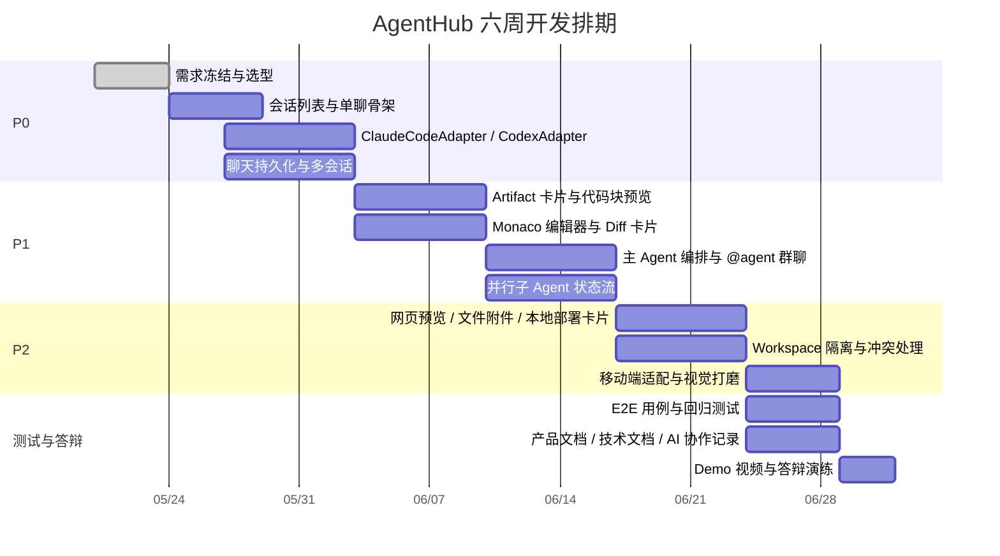

# AgentHub 开源项目深度研究报告

## 执行摘要

截至 2026 年 5 月 20 日，如果目标是做一个**课程项目级、轻量、易部署、演示效果好、且必须能接入 Claude Code** 的 AgentHub，我的结论不是“直接 fork 一个大而全平台”，而是采用**混合式最优解**：以 **Kanna** 作为会话与 adapter 骨架，以 **Claude Code Viewer** 的会话日志、Diff 与 Git 能力作为参考，以 **assistant-ui / shadcn/ui / Monaco / diff viewer / xterm.js** 组合出漂亮的 IM 前端，再把 **Claude Code 官方 `claude -p` / Agent SDK** 做成统一 `ClaudeCodeAdapter`，把 **Codex CLI** 做成 `CodexAdapter`；如果需要沙箱隔离，再借鉴 **OpenHands** 或 **CloudCLI sandbox**。在现成仓库里，**Kanna** 是整体最适合这门课的底座；**CloudCLI** 是功能最完整、远程/移动体验最强的现成方案，但 AGPL 对后续闭源或商业化不友好；**Claude Code Viewer** 最适合补齐“会话历史 + Diff + 远程移动端查看”的能力；而 **LibreChat** 更适合作为“好看 IM 与 artifact UI”的前端参考，而不是 Claude Code 原生底座。官方资料同时表明，Claude Code 已经正式提供 **非交互 `claude -p` 模式** 与 **Python/TypeScript Agent SDK**，因此“把 Claude Code 做成统一适配器”这件事，工程上是可落地且风险可控的。

**结论性推荐按课程适配度排序如下**： 
**第一优先**：**Kanna + 自研 Orchestrator**。理由是轻、干净、MIT、直接支持 Claude Code 与 Codex、现成有 session / provider / event store 骨架，二次开发成本最低。 
**第二优先**：**CloudCLI 直接二开**。理由是多 CLI、移动端、文件树、Git、插件、沙箱已非常完整，最快做出“像 IM 一样可演示”的成品；缺点是 AGPL。 
**第三优先**：**Kanna 前后端骨架 + Claude Code Viewer 的 Diff / 历史交互设计**。理由是适合想做“课设答辩解释得清楚”的同学，架构最容易讲清楚。 
**第四优先**：**LibreChat 前端 + 自定义 ClaudeCodeAdapter**。理由是 UI 和 artifact 展示强，但 Claude Code 不是其原生执行引擎。 
**第五优先**：**OpenHands 仅复用 sandbox / workspace 思路，不建议整仓重改**。理由是能力强，但对课程项目来说偏重，且官方 FAQ 明确说本地实例并不适合多租户生产部署。

## 评估框架

本报告把你关心的能力拆成八个维度，并统一按 **1–5 分** 评分，**分数越高越好**。其中“许可与商用风险”是**风险越低分越高**，“部署复杂度”是**越容易部署分越高**。对课程项目来说，我在推荐时会额外看重三个因素：**Claude Code 接入难度、IM 形态适配度、以及 6 周内能否做出可演示 Demo**。Claude Code 官方文档已经给出了两条很清晰的接入路径：一条是 CLI 非交互模式 `claude -p`，一条是 Python/TypeScript 的 Agent SDK；Codex 官方也提供了 CLI、配置文件与 MCP 支持，这使得“统一 Adapter 层”成为现实可做的方案，而不是概念设计。

在这八个维度里，我的判断标准是：**界面美观度** 看视觉完成度与现代感；**交互流畅性** 看多会话、流式输出、移动端/多端与状态反馈；**功能完整度** 重点看你课题要求中的 IM 聊天、会话历史、群聊/多 Agent、artifact、Diff、预览、部署；**可扩展性** 看是否已经有 provider catalog、plugin、SDK、MCP 或 workflow runtime；**Claude Code 接入难易度** 看是否原生支持或至少能无缝包装官方 CLI/SDK；**文档与社区活跃度** 看官方文档、README 细度、commit/release 活跃度与社区入口；**许可与商用风险** 看 MIT / Apache / AGPL / 自定义许可证；**部署复杂度** 看是否单命令可跑、是否需要 Docker、多服务依赖是否重。Kanna、CloudCLI、Claude Code Viewer、Claude Code Web UI 这一组更偏“直接能接 Claude Code 的聊天壳”；OpenHands、OpenCode、LibreChat 更像“能力平台 / 执行层 / IM 平台”；Langflow、Flowise、Dify、ChatDev 则更偏“编排或可视化工作流底座”。

评分顺序在下文保持一致：**界面 / 交互 / 功能 / 扩展 / Claude 接入 / 文档社区 / 许可 / 部署**。

## 候选项目分析

### Kanna

**链接**：[GitHub](https://github.com/jakemor/kanna) ｜ [README 截图来源](https://github.com/jakemor/kanna)

Kanna 的定位几乎就是”**Claude Code / Codex 的漂亮 Web UI**”。官方 README 直接写明它支持 Claude 与 Codex 切换、项目分组侧边栏、富 transcript、Plan mode、会话恢复，以及基于 WebSocket 的实时订阅；架构上采用 **React + Zustand + Bun Server**，并明确给出 `src/server/agent.ts`、`provider-catalog.ts`、`quick-response.ts`、`ws-router.ts`、`event-store.ts`、`read-models.ts` 等关键模块，本地状态以 JSONL 事件日志与 snapshot 存在 `~/.kanna/data/`。这几乎就是你要的 **adapter / session / event-sourcing** 雏形。


接入 Claude Code 的难度是**最低档**：Kanna 要求本机已有可用的 Claude Code 环境，Codex 作为可选 provider；而 Claude Code 官方已经提供 `claude -p` 的非交互模式与 Agent SDK，所以课程版 AgentHub 完全可以把 Kanna 作为**单聊、多会话、provider 切换、会话持久化**底座，再在 `AgentCoordinator` 上增加 `@agent` 群聊与主 Agent 编排。官方功能表未见真正的 IM 群聊、部署卡片或多人协作说明，所以这部分仍需补做。评分：**5 / 5 / 4 / 5 / 5 / 4 / 5 / 5**。改造成本：**低**。推荐复用方式：**前端 + 后端会话层 + provider catalog + event store**。

### CloudCLI

**链接**：[GitHub](https://github.com/siteboon/claudecodeui) ｜ [官网](https://cloudcli.ai) ｜ [README 截图来源](https://github.com/siteboon/claudecodeui)

CloudCLI 是目前我看到的**现成体验最完整**的 Claude Code / Cursor CLI / Codex / Gemini CLI Web UI 之一。它的 README 明确列出：响应式桌面与移动端界面、聊天界面、内建 shell terminal、文件树、Git Explorer、多 session 管理、插件系统，以及实验性的 Docker sandbox；而且它会**自动发现本机已有 session**，并且读写与你原生 Claude Code 相同的 `~/.claude` 配置。对于“像飞书/微信一样管理多个 Agent 会话”的演示，这一点非常加分。

如果你想要**最快做出成品演示**，CloudCLI 是极强候选，因为移动端、文件预览、Shell、Git、插件页签都已经在产品层完成得比较像样；同时它还提供插件模板，说明其扩展点并不只是“改 prompt”。但它采用 **AGPL-3.0-or-later**，README 也明确指出若修改后以网络服务方式运行，需要向服务用户公开修改过的源码，这对后续商业化或闭源二开发有实质影响。评分：**5 / 5 / 5 / 5 / 5 / 5 / 2 / 4**。改造成本：**低到中**。推荐复用方式：**整仓 fork 做课设 Demo**；如果你担心 AGPL，则只借鉴其移动端布局、插件系统与 sandbox 交互。

### Claude Code Viewer

**链接**：[GitHub](https://github.com/d-kimuson/claude-code-viewer) ｜ [README Demo 来源](https://github.com/d-kimuson/claude-code-viewer)

Claude Code Viewer 的强项不是”最全功能”，而是**会话历史、日志可视化、Diff 与远程查看体验**。它提供新建会话、恢复既有 session、实时监控运行任务、搜索会话、内建终端、Git 操作、PWA 移动访问，以及通过标准 Claude Code 日志目录 `~/.claude` 回放与展示历史。README 还特别强调它有**progressive disclosure** 的 UI 设计，这很适合你的”聊天流中内联展示代码 Diff / 文件 / 产物”的答辩叙事。


它可以**直接接入 Claude Code**，但有一个必须向答辩老师说明的现实点：仓库 README 专门提示，Anthropic 对“订阅账户 + Agent SDK 发送聊天消息”的使用边界在 2026 年 4 月时仍有歧义，因此项目把发送消息、恢复会话、审批等能力做成 opt-in，并建议 API Key 模式获得完整功能。对课程项目来说，这并不致命，反而意味着你可以把它作为**只读日志 viewer + Diff / Git 参考实现**，然后把真正的发送层切到官方 `claude -p` / Agent SDK。评分：**4 / 4 / 4 / 4 / 5 / 4 / 5 / 5**。改造成本：**中**。推荐复用方式：**会话历史、Diff、Git 面板、PWA 远程访问设计**。

### Claude Code Web UI

**链接**：[GitHub](https://github.com/sugyan/claude-code-webui) ｜ [README 截图与 Demo 来源](https://github.com/sugyan/claude-code-webui)

Claude Code Web UI 是一个更**轻、更直接**的 Claude Code Web 客户端。README 明确列出实时流式输出、项目目录选择、历史会话浏览与恢复、工具权限管理、暗黑/亮色和移动端自适配；代码结构也很清楚：`backend/`、`frontend/`、`shared/` 三层拆分，适合作为课程项目讲解”前后端职责边界”的示例。


它的优势是**最容易跑起来**，并且天然就是 Claude Code 的 Web 包装层；缺点是功能边界也更明确，官方 README 主要覆盖单会话交互、历史恢复与权限控制，没有 Kanna 那样的多 provider / provider catalog，也没有 CloudCLI 那样的文件树、Git Explorer、插件和沙箱。它另一个重要提示是**不要直接暴露到公网**。评分：**4 / 4 / 3 / 4 / 5 / 4 / 5 / 5**。改造成本：**低**。推荐复用方式：**最小可运行 Demo、Claude Code Adapter、移动端 Chat 壳**。

### Opcode

**链接**：[GitHub](https://github.com/winfunc/opcode) ｜ [项目首页](https://opcode.sh) ｜ [README Demo 来源](https://github.com/winfunc/opcode)

Opcode 是一个**桌面优先**的 Claude Code GUI，基于 **Tauri 2 + React + Rust**。它的 README 给出了项目/会话管理、自定义代理、后台执行、Usage Analytics、MCP Server 管理、Timeline & Checkpoints、Diff Viewer、CLAUDE.md 编辑器等能力，还明确列出了前端 `src/` 与 Tauri 后端 `src-tauri/` 的结构，后端中有 `commands/`、`checkpoint/`、`process/` 等模块。对于“会话 timeline + checkpoint + diff”这类高产品感能力，它非常值得参考。

不过 Opcode 更像“本地桌面控制台”，而不是 IM 式多 Agent 平台；而且它采用 **AGPL**，对未来商用也有风险。作为课设，我会把它定位为“**高产品感桌面 GUI 参考仓库**”，而不是主底座。评分：**4 / 4 / 4 / 4 / 5 / 4 / 2 / 3**。改造成本：**中到高**。推荐复用方式：**桌面端、checkpoint / timeline / diff viewer 交互设计**。

### OpenCode

**链接**：[GitHub](https://github.com/anomalyco/opencode) ｜ [官网](https://opencode.ai) ｜ [文档](https://opencode.ai/docs) ｜ [截图来源](https://github.com/anomalyco/opencode)

OpenCode 不是 Claude Code UI，而是一个**非常成熟的开源 coding agent 平台**。官方仓库与文档表明它有内建 agent、`@general` 子 agent、桌面版、`opencode serve` 与 `opencode web`、JS/TS SDK、插件、技能、规则、MCP、GitHub 集成、多会话，以及 `packages/web`、`packages/desktop`、`packages/sdk`、`packages/llm`、`packages/plugin`、`packages/containers` 等清晰的模块拆分。对你做 AgentHub 来说，它最大的价值不是“直接接 Claude Code”，而是**作为另一家实现优秀的 coding-agent 架构样本**。

OpenCode **不能原生当 Claude Code 壳直接用**，但因为它有 SDK / web server / plugin 机制，而 Claude Code 又有 `claude -p` 与 Agent SDK，所以工程上完全可以把 Claude Code 封成 sidecar adapter，再挂到你自己的平台里；这是基于两边官方能力做出的**工程推断**。需要注意的是，OpenCode 默认权限模型偏激进，官方文档写明默认允许所有操作、不需要显式审批；如果你借鉴它的执行层，一定要把权限改成“ask”模式。评分：**4 / 4 / 4 / 5 / 2 / 5 / 5 / 4**。改造成本：**中**。推荐复用方式：**coding-agent 后端、plugin / SDK 设计、规则 / skills / MCP 参考**。

### OpenHands

**链接**：[GitHub](https://github.com/OpenHands/OpenHands) ｜ [文档](https://docs.openhands.dev) ｜ [Cloud Demo](https://app.all-hands.dev)

OpenHands 是目前最成熟的开源 AI 软件开发平台之一，也是**最强的 sandbox / workspace / runtime 参考仓库**之一。官方说明它同时提供 SDK、CLI、本地 GUI、Cloud；本地 GUI 是“REST API + 单页 React 应用”；SDK 文档又明确给出四包式架构：`openhands.sdk`、`openhands.tools`、`openhands.workspace`、`openhands.agent_server`，并区分本地开发与生产/沙箱两种部署模式。这种“UI、SDK、workspace、agent server 分层”的设计，非常适合你在答辩时讲“为什么要把 adapter、workspace、orchestrator 解耦”。

但它对课程项目来说**偏重**。官方 GUI server 需要 Docker，文档明确说完整 GUI 依赖 Docker，并大约需要 2GB 镜像空间；FAQ 还明确说本地 OpenHands 更适合单用户，不适合多租户生产场景。如果你只做课设 Demo，我建议**只复用它的 Docker sandbox / workspace 思路**，不要整仓魔改。评分：**4 / 4 / 5 / 5 / 3 / 5 / 4 / 2**。改造成本：**高**。推荐复用方式：**sandbox、workspace abstraction、容器执行隔离**。

### LibreChat

**链接**：[GitHub](https://github.com/danny-avila/LibreChat) ｜ [官网](https://librechat.ai) ｜ [文档](https://www.librechat.ai/docs)

如果你想把 AgentHub 做成真正像“**ChatGPT / 飞书 / 微信**”的聊天体验，LibreChat 是非常值得研究的前端与平台样本。官方 README 列出它支持 Anthropic / OpenAI / Google 等模型、Artifacts、Agents、Subagents、MCP、Code Interpreter、消息搜索、会话分支、可恢复流、Multi-Tab / Multi-Device Sync、多用户认证等；而配套的 `@librechat/agents` 包又提供 graph orchestration、streaming event handling、tool execution、provider adapters、JSONL session tree，以及 session 的 clone / fork / compact / checkpoint 能力。

LibreChat **不是 Claude Code 原生壳**，它更接近一个“多模型、多工具、带 artifacts 的 AI IM 平台”。也正因为如此，它很适合成为你的**前端壳**：左侧会话列表、消息流、artifact 区、message branching、agent marketplace 都能直接给你产品感。部署上官方 docs 推荐 Docker Compose，本地安装大约 5 分钟，但它会带上 MongoDB、MeiliSearch、RAG API 和 vector DB，明显比 Kanna 那类单进程应用更重。评分：**5 / 5 / 5 / 5 / 2 / 5 / 5 / 3**。改造成本：**中**。推荐复用方式：**IM 前端、artifact UI、multi-agent session runtime 参考**。

### Langflow

**链接**：[GitHub](https://github.com/langflow-ai/langflow) ｜ [官网](https://www.langflow.org) ｜ [文档](https://docs.langflow.org)

Langflow 的价值不在 IM，而在**可视化编排与工具化输出**。官方 README 指出它有 visual builder、interactive playground、multi-agent orchestration、部署为 API、导出 JSON，以及“把 flow 作为 MCP server 对外暴露”的能力；代码结构上也很清晰，`src/backend`、`src/frontend`、`src/sdk`、`src/lfx` 分层明确。对 AgentHub 来说，Langflow 适合拿来做“**Workflow 视图 / Agent 编排视图**”，而不是主聊天底座。

Langflow 对 Claude Code 不是原生支持，接入方式更适合做**外部 orchestrator**：例如让主 Agent 把复杂任务转成 flow，再回到聊天流展示执行过程。官方提供桌面版、`uv pip install langflow` 的本地方式和 Docker 部署，部署也比 OpenHands / Dify 轻。评分：**4 / 4 / 4 / 5 / 2 / 5 / 5 / 4**。改造成本：**中**。推荐复用方式：**可视化 workflow / MCP server / orchestration 视图**。

### Flowise

**链接**：[GitHub](https://github.com/flowiseai/flowise) ｜ [文档](https://docs.flowiseai.com)

Flowise 与 Langflow 都是强视觉编排平台，但它更偏**低代码 agent canvas**。官方仓库说明它由 `packages/server`、`packages/ui`、`packages/components`、`packages/api-documentation` 四部分组成；官方文档则进一步区分 **Chatflow**（单 agent / chatbot）和 **Agentflow**（可做聊天助手、单 agent、多 agent 与复杂编排），其中 Agentflow V2 明确指向多 Agent 系统。


Flowise 很适合复用“**Workflow 画布 + 参数配置 + 节点式编排**”，但不适合拿来当你的 IM 主界面主底座。另一个要注意的点是官方 docs 提醒 flow 默认可以公开访问，若要做授权控制，需要为 flow 配 API key；这对课设虽然不是大问题，但答辩时可以作为安全点讲出来。评分：**4 / 4 / 4 / 4 / 2 / 5 / 5 / 4**。改造成本：**中**。推荐复用方式：**工作流设计器、节点配置、Agentflow 可视化**。

### Dify

**链接**：[GitHub](https://github.com/langgenius/dify) ｜ [官网](https://dify.ai) ｜ [文档](https://docs.dify.ai) ｜ [Cloud](https://cloud.dify.ai)

Dify 是**产品完成度非常高**的 agent / workflow 平台，界面也足够成熟。官方 README 写得很清楚：它集成 visual workflow、RAG、agent capabilities、prompt IDE、模型管理与 observability，并且自带后端 API；从代码层面看，仓库顶层有 `api/`、`web/`、`dify-agent/`、`sdks/`、`docker/` 等目录，属于“前后端 + agent runtime + SDK”都较完整的体系。

Dify 的问题在于它**并不适合直接做 Claude Code IM 壳**，而更像是“你聊天平台后面那个 agent workflow 引擎”。另外它的许可证不是纯 Apache 2.0，而是 **Dify Open Source License**，README 明确说这是“based on Apache 2.0 with additional conditions”，这意味着如果你关心后续商用，要仔细读条款。对于课程项目，如果你很想展示 workflow 设计器，Dify 可以做参考，但我不建议你把它当最小实现基础。评分：**5 / 4 / 5 / 4 / 2 / 5 / 3 / 3**。改造成本：**高**。推荐复用方式：**后端 workflow / tool orchestration / prompt IDE 交互参考**。

### ChatDev

**链接**：[GitHub](https://github.com/OpenBMB/ChatDev) ｜ [中文 README](https://github.com/OpenBMB/ChatDev/blob/main/README-zh.md)

ChatDev 2.0 的亮点是它已经从”虚拟软件公司”演进成了 **DevAll 零代码多 Agent 编排平台**。官方仓库与中文 README 都强调它现在支持通过简单配置定义 Agent、Workflow 与任务，能覆盖数据可视化、3D 生成、深度调研等；Web Console 也提供了 tutorial 与 visual canvas。仓库结构里 `frontend/`、`server/`、`workflow/`、`runtime/`、`entity/`、`yaml_template/`、`yaml_instance/` 等目录非常适合用来学习”多 Agent runtime + YAML workflow”的组织方式。


但 ChatDev 的适配点更多在**Orchestrator 设计**，而不是漂亮 IM。文档里进一步给出 Agent Node、Memory Module、Workflow Authoring Guide，并提到 memory 核心代码在 `entity/configs/memory.py` 与 `node/agent/memory/*.py`。这说明它非常适合你借鉴 **agent graph / workflow schema / memory model**，但不适合直接拿来当聊天平台 UI。评分：**3 / 3 / 4 / 4 / 2 / 4 / 5 / 2**。改造成本：**高**。推荐复用方式：**多 Agent 编排逻辑、YAML workflow schema、Memory 设计**。

## 可复用的 UI 组件与模板

如果你决定采用“**轻量自研 UI + 现成 Adapter**”的方案，而不是整仓 fork，那么前端最佳组合非常明确。**assistant-ui** 是我最推荐的聊天 UI 基座，因为它本身就是为 AI chat 做的 React / TypeScript 库，README 明确给出 `Thread`、`Message`、`Composer`、`ThreadList`、`ActionBar` 等原语，支持 streaming、attachments、markdown、code highlight、voice dictation、tool-call 的 generative UI，还能切到自定义 runtime；对于 AgentHub 来说，这几乎正好对应“会话列表 + 消息气泡 + 富媒体卡片 + 工具审批”的 UI 需求。集成建议是：用它做消息流、thread list、composer 和 artifact slot，把你自己的 `ClaudeCodeAdapter` / `CodexAdapter` 通过 custom runtime 喂进去。

**shadcn/ui** 适合解决“漂亮而不臃肿”的通用壳层问题。官方 docs 把它定义为一套可复制、可扩展、可自定义的组件与代码分发平台，非常适合做 sidebar、dialog、sheet、tabs、dropdown、toast、command palette 和 card。集成建议是：把 AgentHub 的**左侧会话列表、右侧 artifact 抽屉、Agent 选择器、设置面板**全部放在 shadcn/ui 上层，这样视觉上很容易做出接近 Linear / Vercel / Perplexity 这一类产品的质感。

代码编辑与预览部分，优先选 **monaco-react**。它是 React 下最直接、最轻摩擦的 Monaco 编辑器封装，适合做**内联代码编辑器、文件预览、只读 artifact viewer**。如果你做“点击卡片展开全屏编辑器”，这是最稳妥的路线。

Diff 视图建议优先看 **react-diff-view**，因为它支持 split / unified 两种展示，且强调 decoration、comment widget 和更灵活的扩展；如果你只想要最简单上手版，**react-diff-viewer** 也能用，但课程项目更建议前者，因为更接近 GitHub PR 式的交互。集成建议是：把 Claude Code 或 Codex 产出的修改先转成 unified diff，再在聊天流内插入一张 Diff 卡片；点击“应用”时再落到 workspace patch。

网页终端建议直接用 **xterm.js**。它是浏览器里的成熟终端组件，README 说明它被 VS Code 等项目使用；如果你后续想把 `claude`、`codex`、`git`、`pnpm dev` 的运行结果嵌到右侧 panel 或底部 drawer，xterm.js 基本是标准答案。

如果你想要**完整 UI 模板**而不是零件，两个很值得直接抄的项目是 **Vercel 的 Chatbot 模板** 与 **NextChat**。前者是 Next.js + AI SDK 的全功能聊天模板，适合拿来做“流式对话 + 服务端 action + 登录”骨架；后者则更轻、更快、PWA 和响应式做得好，适合参考会话列表与移动端聊天体验。它们都不是多 Agent coding 平台，但非常适合给你的 AgentHub 补“产品感”。

## 综合对比与结论性推荐

先看评分汇总。表格中的总分采用八维**等权相加**；但最终推荐顺序会额外考虑这门课的核心约束：**必须接 Claude Code、必须 IM 化、必须 6 周内做出可演示课程项目**。

| 项目 | 界面 | 交互 | 功能 | 扩展 | Claude 接入 | 文档社区 | 许可 | 部署 | 总分 |
|---|---:|---:|---:|---:|---:|---:|---:|---:|---:|
| Kanna | 5 | 5 | 4 | 5 | 5 | 4 | 5 | 5 | 38 |
| CloudCLI | 5 | 5 | 5 | 5 | 5 | 5 | 2 | 4 | 36 |
| Claude Code Viewer | 4 | 4 | 4 | 4 | 5 | 4 | 5 | 5 | 35 |
| LibreChat | 5 | 5 | 5 | 5 | 2 | 5 | 5 | 3 | 35 |
| Claude Code Web UI | 4 | 4 | 3 | 4 | 5 | 4 | 5 | 5 | 34 |
| OpenCode | 4 | 4 | 4 | 5 | 2 | 5 | 5 | 4 | 33 |
| Langflow | 4 | 4 | 4 | 5 | 2 | 5 | 5 | 4 | 33 |
| OpenHands | 4 | 4 | 5 | 5 | 3 | 5 | 4 | 2 | 32 |
| Flowise | 4 | 4 | 4 | 4 | 2 | 5 | 5 | 4 | 32 |
| Dify | 5 | 4 | 5 | 4 | 2 | 5 | 3 | 3 | 31 |
| Opcode | 4 | 4 | 4 | 4 | 5 | 4 | 2 | 3 | 30 |
| ChatDev | 3 | 3 | 4 | 4 | 2 | 4 | 5 | 2 | 27 |

如果只看“**最优落地方案**”，我建议你这样取舍：

**总推荐方案**：**Kanna + 自研 Orchestrator + assistant-ui / shadcn/ui 组件化重构**。 
这套组合最符合“轻量、中文汇报好讲、6 周内能完成”的现实约束。Kanna 已经有会话、provider、事件存储与 WebSocket 机制，Claude Code 官方又提供 `claude -p` 与 Agent SDK；你只需要补 `@agent` 路由、主 Agent 拆任务、artifact 卡片与 preview，即可把它变成课程要求中的 AgentHub。

**最快做 Demo 的方案**：**CloudCLI 直接二开**。 
如果你的目标是“短时间做出像产品一样的演示”，CloudCLI 的移动端、Git、文件树、插件和 sandbox 会帮你节省大量工作量。但 AGPL 是明确代价，所以适合课设，不适合你后面拿去做闭源创业原型。

**最适合补齐产品感的参考**：**Claude Code Viewer + LibreChat**。 
前者最适合学会话流与 Diff，后者最适合学 artifact UI、subagent 与 IM 质感。如果你最终仍然选择 Kanna 作为底座，这两个项目会是最好的“第二参考仓库”。

**为什么我不建议把 OpenHands / Dify / ChatDev 作为主仓直接魔改**： 
因为这三类项目都更像“平台”而不是“你这门课要求的 IM 界面产品”，它们在课程项目里最有价值的是**借架构、不借整仓**。OpenHands 借 sandbox，Dify 借 workflow 体验，ChatDev 借 orchestrator / workflow schema。这么做，你既可以保持项目轻，又能在答辩时讲出“参考了成熟平台的哪一层”。

## 开发路线图与快速启动

下面给出一个**六周**的课程项目路线图。原则是：**先做 P0 可跑 Demo，再做 P1 群聊编排，最后做 P2 产品感增强**。如果你选 Kanna 方案，这个排期最稳；如果你选 CloudCLI，周次可以再前移半周到一周。这个路线图是面向课设交付而设计的，不追求企业级完备性。



对应的每周里程碑建议如下： 
**第一周** 完成需求冻结、底座 fork、技术栈选型与 UI 低保真稿，交付物是项目结构、路由、左侧会话列表、单聊窗口空壳。 
**第二周** 打通 `ClaudeCodeAdapter` 与 `CodexAdapter`，支持新建会话、恢复会话、流式输出、消息持久化，交付物是能和两个 Agent 对话的最小版 Demo。这个阶段最值得直接参考的分别是 Kanna 的 `AgentCoordinator / EventStore`，以及 Claude Code 官方 `claude -p` / Agent SDK 文档。 
**第三周** 上 artifact 卡片、Monaco、Diff 卡片、代码块复制与“应用变更”，交付物是“聊天里看代码 / 看 diff / 预览页面”的产品感。 
**第四周** 做主 Agent、`@agent` 群聊、任务拆解、并行状态流，交付物是一个群聊窗口里多个子 Agent 轮流回复。 
**第五周** 做 preview / deploy card / sandbox / workspace 冲突处理，交付物是“生成网页并预览 / 一键本地启动 / 查看部署状态”。 
**第六周** 做响应式适配、测试、文档、3 分钟视频与答辩讲稿，交付物是完整 Demo 包与演示素材。

下面是**可直接复用的仓库克隆命令**，优先列出我建议你先看的六个，再补两个可选参考：

```bash
git clone https://github.com/jakemor/kanna.git
git clone https://github.com/siteboon/claudecodeui.git
git clone https://github.com/d-kimuson/claude-code-viewer.git
git clone https://github.com/sugyan/claude-code-webui.git
git clone https://github.com/danny-avila/LibreChat.git
git clone https://github.com/OpenHands/OpenHands.git
git clone https://github.com/langflow-ai/langflow.git
git clone https://github.com/FlowiseAI/Flowise.git
```

以上仓库地址均来自各自官方 GitHub 仓库首页。

下面给出至少三个、实际上是六个**可运行 Demo 的快速启动方式**。你可以优先试跑 Kanna、CloudCLI、Claude Code Web UI 这三项，因为它们最接近你的课题目标。

**Kanna 快启**

```bash
bun install -g kanna-code
kanna
# 默认打开 http://localhost:3210
```

Kanna 官方 README 要求 Bun 1.3.5+，并需要已有可用的 Claude Code 环境；Codex 支持是可选的。

**CloudCLI 快启**

```bash
npx @cloudcli-ai/cloudcli
# 打开 http://localhost:3001
```

CloudCLI README 指出自托管 npm 方式要求 Node.js v22+，并会自动发现已有 sessions。

**Claude Code Web UI 快启**

```bash
npm install -g claude-code-webui
claude-code-webui
# 打开 http://localhost:8080
```

该项目 README 同时给出 npm、二进制和开发模式三种启动方法，并要求已安装并认证 Claude CLI。

**Claude Code Viewer 快启**

```bash
npx @kimuson/claude-code-viewer@latest --port 3400
# 打开 http://localhost:3400
```

官方说明其默认可直接从 npm 启动，并支持密码保护、远程访问与 PWA。

**OpenHands 本地 GUI 快启**

```bash
uv tool install openhands --python 3.12
openhands serve --mount-cwd
# 打开 http://localhost:3000
```

OpenHands 官方 docs 说明 `openhands serve` 会启动完整 GUI，依赖 Docker，`--mount-cwd` 会把当前目录挂载到容器中的 `/workspace`。

**Flowise 与 Langflow 快启**

```bash
# Flowise
npm install -g flowise
npx flowise start
# 打开 http://localhost:3000

# Langflow
uv pip install langflow -U
uv run langflow run
# 打开 http://127.0.0.1:7860
```

这两个项目都提供官方的本地快速启动文档，Flowise 用 Node 生态更顺手，Langflow 用 Python / uv 更顺手。

如果你还想试更完整的自托管平台，这两条命令也值得保存：

```bash
# LibreChat
git clone https://github.com/danny-avila/LibreChat.git
cd LibreChat
cp .env.example .env
docker compose up -d

# Dify
git clone https://github.com/langgenius/dify.git
cd dify/docker
cp .env.example .env
docker compose up -d
```

LibreChat 官方 docs 推荐 Docker Compose 作为本地安装首选；Dify 官方 README 也明确写明了 Docker Compose 的起步方式，并给出最小 CPU / 内存要求。

## 风险、来源优先级与增强建议

从工程风险看，最需要你在答辩里主动说明的是**执行安全、workspace 冲突、许可证和部署复杂度**。执行安全方面，CloudCLI 的 README 明确写到 Claude Code 工具默认全部关闭，OpenHands 推荐 Docker sandbox，而 OpenCode 文档则说明默认允许所有操作；这三种设计差异本身就是一个很好的答辩点：为什么你的课程项目应该选择“默认 ask / deny，再逐步放权”。对于课程场景，我建议把 Claude Code、Codex、子 Agent 的文件写入都收口到**独立 workspace**，最简单的是 `git worktree` 或目录级副本；真正需要强隔离时，再借 OpenHands 的 Docker workspace 或 CloudCLI 的 sandbox 模式。

并发 workspace 冲突方面，最大的真实风险不是“模型乱说”，而是**多个 Agent 同时改同一套文件**。课程项目里不建议做复杂 CRDT；最实用的做法是：主 Agent 只下发任务，不直接写主分支，子 Agent 在隔离分支或独立 workspace 产出 patch，最终由主 Agent 或用户在聊天流中做 patch merge / diff apply。Kanna 的事件日志、Claude Code Viewer 的 Diff/Git 面板、Opcode 的 checkpoint/timeline 都能给你这种设计灵感。

许可证与商业化风险要单独拎出来。**MIT / Apache 2.0** 最轻，像 Kanna、Claude Code Viewer、Claude Code Web UI、OpenCode、Langflow、Flowise、ChatDev 都相对友好；**CloudCLI 与 Opcode 的 AGPL** 会对网络服务二次分发提出更强约束；**Dify** 不是纯 Apache 2.0，而是附加条件许可证；**OpenHands** 的核心 MIT 没问题，但 `enterprise/` 目录是 source-available，不是同一套开放许可。对于课程项目，这些都不是阻塞，但如果你未来想继续做商用版本，尽量避开 AGPL 和自定义限制许可证做主底座。

在查阅来源时，我建议按下面的优先级走，而且**能查中文官方资料就先查中文**：**官方 repo / README** 最优先，因为它最容易定位结构与启动命令；**官方 docs** 第二，因为它能解释架构与配置；**官方 Demo / Cloud 页面 / README 内视频** 第三，因为你要做 UI 与 Demo；**GitHub Issues / Discussions** 第四，因为它最能暴露边界与坑；**论文 / 技术报告** 第五，适合补论证，但不适合当集成手册。CloudCLI、Dify、Flowise、ChatDev 都提供了中文 README 或明确的中文入口，Claude Code 也有中文官方文档，这会降低你整理中文答辩材料的成本。

最后给出增强建议。 
**短期可实现增强**： 
其一，做一个**群聊状态时间线**，把 Orchestrator 的“拆任务 → 子 Agent 执行 → 聚合结果”显示成 Chat 中的状态卡。 
其二，做一个**Diff 一键应用 + 回退** 按钮，把聊天流真正变成“可操作的开发面板”。 
其三，做一个**网页 Preview 卡片**，支持在聊天流内直接打开本地 dev server 预览。 

**长期可实现增强**： 
其一，做 **workspace snapshot / checkpoint**，把每次 Agent 执行结果沉淀成版本历史，这样你就能向 Viewer / Opcode 那类交互靠齐。 
其二，做 **双视图同步**，即“IM 聊天视图”与“Workflow 画布视图”双向同步，群聊窗口里的 `@agent` 自动映射到画布节点。 
其三，做 **Agent Marketplace + Rules/Skills Center**，把 Claude Code 的 `CLAUDE.md`、OpenCode 的 `AGENTS.md`、LibreChat 的 `SKILL.md` 统一成你的课程项目中可配置、可复用的“协作规范库”。