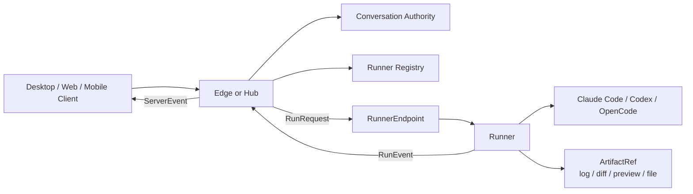
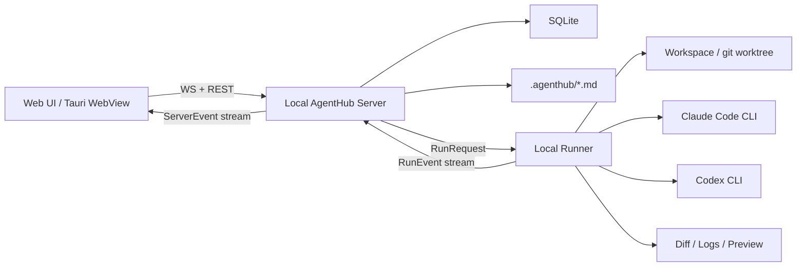
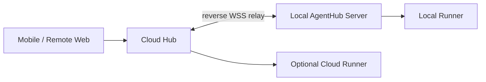

# AgentHub Architecture Optimization

Date: 2026-05-21

## 结论

当前 `Hub-Edge-Runner` 方向是对的，优化重点不是把架构一开始收窄，而是把**长期完整模型**和**阶段落地范围**分清楚。

AgentHub 从第一天就应该按完整形态设计：

```text
Client -> Edge / Hub -> RunnerEndpoint -> Agent CLI
```

其中 Hub、Edge、Runner 都是长期架构概念；RunnerEndpoint 可以是本地 Runner、远程 Desktop Runner 或 Cloud Runner；Transport 可以是 local、SSH、Tailscale、Hub Relay 或 Cloud 内网。

实现顺序可以先从本地闭环开始，但接口和数据模型不能写死成本地单机。更完整的部署拓扑见 [topology.md](topology.md)。

推荐原则：

1. **架构视野完整**：一开始保留 Hub、Edge、Runner、RunnerEndpoint、ConversationAuthority、ArtifactLocation。
2. **实现路径收敛**：第一阶段只实现 local transport 和本地 Runner，但协议按远程可扩展设计。
3. **语义不混淆**：Edge 管会话/上下文/调度，Runner 管执行，Hub 管注册/同步/中继。

## 当前架构的主要问题

### 1. Hub 过早进入主链路

现有文档把 Hub 定义为 IM 大脑，负责用户、消息、好友、群聊、多端同步、Edge 注册和远程中继。这适合长期产品，但对 P0 Demo 会带来三个问题：

- 本地单用户场景也要理解 Hub / Edge 双服务，开发和答辩复杂度上升。
- 消息主存、同步副本、离线缓存的边界容易在实现早期混乱。
- 团队需要同时实现中心 IM、同步协议、Runner 调度和 UI，风险过高。

优化建议：本地离线场景中由 Local Edge 承担 IM、消息、Agent、Memory、Runner 管理；但 Hub 的注册、同步、中继接口应在协议层预留，避免后续远程 Desktop Runner、Cloud Runner、Web Relay 需要重构。

### 2. Edge 和 Runner 边界还需要更硬

现有设计说 Edge 管 Memory / Context / Runner，Runner 管执行 / Diff / Preview / 日志。这个方向正确，但需要明确 Runner 不应保存任何长期业务状态。

建议边界：

| 能力 | Edge Server | Runner |
|---|---|---|
| Conversation / Message | 主存 | 不碰 |
| Agent Profile / Contact | 主存 | 不碰 |
| Context Builder | 主逻辑 | 接收最终 prompt/context |
| Project Memory | Markdown 主存 + DB 索引 | 只读需要的工作区文件 |
| Run 状态 | 主存 | 上报事件 |
| stdout/stderr 日志 | 索引路径 | 文件主存 |
| Diff / Artifact 元数据 | 索引 | 产生 patch / 文件 |
| Workspace 文件 | 管理引用 | 实际读写 |

### 3. 目录按未来形态拆得太细

现在 `services/hub-server/internal/*`、`services/edge-server/internal/*`、`services/runner/internal/*` 已经列出大量子模块，但仓库还没有实现代码。过早铺开目录会导致 Codex 生成时分散，三个人也很难并行集成。

优化建议：第一阶段按“可运行纵切”落代码，但目录和接口仍体现长期分层。不要把 Edge 和 Runner 合并成不可拆的单体。

推荐 P0 最小后端模块：

```text
services/edge-server/
  cmd/
  internal/
    api/              # REST + WebSocket
    store/            # SQLite
    im/               # conversation/message/member
    agents/           # agent profile/contact
    context/          # context builder
    orchestrator/     # @mention/direct/sequential
    runnerclient/     # local runner client

services/runner/
  cmd/
  internal/
    service/          # Runner API
    executor/         # process lifecycle
    adapters/         # claude-code/codex/opencode
    workspace/        # per-run workspace/worktree
    artifacts/        # diff/log/preview output
```

如果第一阶段只实现本地能力，也应明确 `services/edge-server` 是 Local Edge，而不是最终替代 Hub 的单体。

## 推荐目标架构

### 长期统一链路



这个模型覆盖本地、远程 Desktop、Cloud、Web 中继等全部形态。差异只在 `Entry`、`Authority`、`RunnerEndpoint` 和 `Transport`。

### 第一阶段可运行链路



这条链路能覆盖课程最关键的演示点：

- IM 会话列表和消息流。
- 单聊 Claude Code / Codex。
- 群聊中 `@ClaudeCode @Codex` 调度。
- Runner 真实启动 Agent CLI。
- 聊天流中显示日志、代码块、Diff、Preview 卡片。
- SQLite 持久化会话、消息、运行记录和 Artifact 元数据。
- `.agenthub/` Markdown 保存项目规则、AI 协作记录和长期 Memory。

### 远程扩展链路



Hub 的职责不是被否定，而是作为远程控制平面进入：

- 远程查看任务状态。
- 多端同步消息摘要。
- 远程下发 `run.start`。
- 管理设备注册和反向连接。

Hub 不应该阻塞第一阶段本地 Demo，但协议层必须从第一天考虑 Hub Relay 和 Runner Registry。

## 数据模型优化

P0 先实现 8 张表即可：

| 表 | 用途 |
|---|---|
| `projects` | 项目 / workspace |
| `agents` | Claude Code、Codex、Reviewer、自定义 Agent |
| `conversations` | 单聊和群聊统一抽象 |
| `conversation_members` | 用户和 Agent 都是成员 |
| `messages` | IM 消息主存 |
| `runs` | 一次 Agent 执行 |
| `artifacts` | Diff、文件、预览、日志元数据 |
| `memory_documents` | Markdown Memory 的索引 |

暂时不要做：

- 多租户权限表。
- 复杂好友关系。
- 向量数据库。
- 完整同步游标。
- 云端消息冲突合并。

这些都不是 P0 Demo 的关键路径。

## Protocol 优先级

现有 README 已经把 `packages/protocol/` 作为共享类型目录，这是正确的。下一步应先定协议，再写 UI 和后端。

建议第一批协议只包含：

```ts
type Conversation = {
  id: string
  type: "direct" | "group"
  title: string
  projectId?: string
  pinned: boolean
  archived: boolean
  lastMessageAt: string
}

type Message = {
  id: string
  conversationId: string
  senderType: "user" | "agent" | "system" | "runner"
  senderId: string
  content: string
  mentions: string[]
  status: "sending" | "streaming" | "done" | "failed"
  artifactIds: string[]
  createdAt: string
}

type Run = {
  id: string
  conversationId: string
  agentId: string
  status: "queued" | "running" | "succeeded" | "failed" | "cancelled"
  workspacePath: string
  startedAt?: string
  endedAt?: string
}

type Artifact = {
  id: string
  type: "diff" | "file" | "preview" | "log" | "code" | "deploy"
  title: string
  storageType: "db" | "local-file" | "url"
  path?: string
  url?: string
  metadata: Record<string, unknown>
}

type ServerEvent =
  | { type: "message.created"; message: Message }
  | { type: "message.delta"; messageId: string; delta: string }
  | { type: "run.started"; run: Run }
  | { type: "run.event"; runId: string; level: "info" | "warn" | "error"; text: string }
  | { type: "artifact.created"; artifact: Artifact }
  | { type: "run.finished"; runId: string; status: Run["status"] }
```

这批类型足够让前端、后端、Runner 三条线并行开发。

## Orchestrator 收敛

不要在 P0 做复杂 DAG。只需要四种策略：

| 策略 | 触发 | 行为 |
|---|---|---|
| `direct` | 用户明确 `@ClaudeCode` | 直接调对应 Agent |
| `sequential` | `@Planner @ClaudeCode @Reviewer` | 按顺序执行 |
| `parallel` | `@ClaudeCode @Codex 分别给方案` | 并行执行并回流消息 |
| `review` | 生成代码后 | Reviewer 读取 diff 并输出审查 |

这样既能展示“多 Agent 协作”，又避免实现一个难调试的通用工作流引擎。

## Artifact 设计优化

聊天消息不要塞大内容。Message 只负责表达，Artifact 负责承载产物。

推荐 P0 Artifact：

- `log`：Runner stdout/stderr 文件路径。
- `diff`：unified diff patch 文件路径。
- `file`：生成或修改的文件路径。
- `preview`：本地 dev server URL。
- `code`：小代码片段，可直接存在 DB。

UI 上采用“三栏结构”：

- 左侧：会话 / Agent 联系人。
- 中间：IM 消息流。
- 右侧：Artifact 面板，显示 Diff、文件、日志、Preview。

聊天流里只放摘要卡片，重内容在右侧打开。

## Memory 设计优化

P0 不做自动长期记忆写入，先做可解释、可版本管理的 Markdown Memory。

推荐 `.agenthub/`：

```text
.agenthub/
  project.md          # 项目目标、架构原则、当前决策
  rules.md            # AI 协作规则和安全规则
  architecture.md     # 架构说明
  agents/
    claude-code.md
    codex.md
    reviewer.md
  conversations/
    <conversation-id>-summary.md
```

写入规则：

- 消息历史主存 SQLite。
- Memory 文档主存 Markdown。
- SQLite 只索引 Memory 文档路径、标题、scope、content。
- 自动更新 Memory 必须先生成建议卡片，由用户确认后再写入。

这能直接回应课程考察中的“AI 协作 Spec、skill、rules 沉淀”。

## 实现顺序

### 第 1 阶段：协议和本地 IM

- 建 `packages/protocol`。
- 建 SQLite schema。
- 实现 conversation/message/agent CRUD。
- Web UI 做三栏布局和本地消息流。

### 第 2 阶段：Runner 和真实 Agent

- Runner 提供 `POST /runs` 和 run event stream。
- Claude Code Adapter 先支持非交互执行。
- Codex Adapter 接第二个真实 CLI。
- 每次运行产生 log artifact。

### 第 3 阶段：Artifact 和 Preview

- 解析 git diff 生成 diff artifact。
- UI 接 Diff 卡片和右侧 Diff 面板。
- 支持本地 preview URL artifact。
- 支持一键打开 workspace 文件。

### 第 4 阶段：群聊和 Orchestrator

- 实现 `@Agent` mentions。
- 实现 direct/sequential/parallel/review 四种策略。
- 聊天流展示每个 Agent 的状态消息。
- Reviewer 能读取前一个 run 的 diff artifact。

### 第 5 阶段：协作记录和答辩材料

- `.agenthub/project.md`、`rules.md`、`architecture.md` 成为项目权威文档。
- 记录当前实现状态、项目规则和 Demo 路径。
- 准备 3 分钟 Demo 路径：新建群聊 -> 生成页面 -> 查看 Diff -> Preview -> Reviewer 审查。

## 推荐改动清单

短期建议直接调整：

1. README 使用 `hub-server / edge-server / runner` 命名，并把 Desktop、Cloud Node 都解释成 Edge Node。
2. 新增 `docs/topology.md`，明确完整拓扑、控制面、数据面、同步面和八种连接场景。
3. 新增 `docs/protocol.md`，先锁定 Conversation、Message、Run、Artifact、ServerEvent。
4. 保持 `services/edge-server` 命名，明确它可运行在 Desktop、远程机器或 Cloud 节点上。
5. 保持 `services/hub-server` 命名，明确它是中心控制面，不是本地 Runner 管理器。
6. 先删除或冻结过细的空目录生成，改为按纵切功能落代码。

## 最终建议

AgentHub 应该以 **IM 本地可运行 Demo** 为第一目标，而不是以完整分布式系统为第一目标。

最稳的架构叙事是：

> AgentHub 的核心是 Conversation 驱动的多 Agent 协作。Edge Server 负责本地/边缘 IM、上下文、Memory、Runner 管理和调度；Runner 负责真实执行 Claude Code / Codex，并把日志、Diff、Preview 作为 Artifact 回传；Hub Server 负责账号、云端 IM、多端同步、权限、设备注册和中继。第一阶段可以只实现本地 Edge + Runner，但协议从第一天保留 Hub、Route Resolver、Conversation Authority 和 Execution Authority。

这套架构更容易实现、展示和答辩，也更符合当前课题的评分权重。
