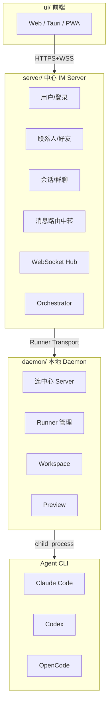
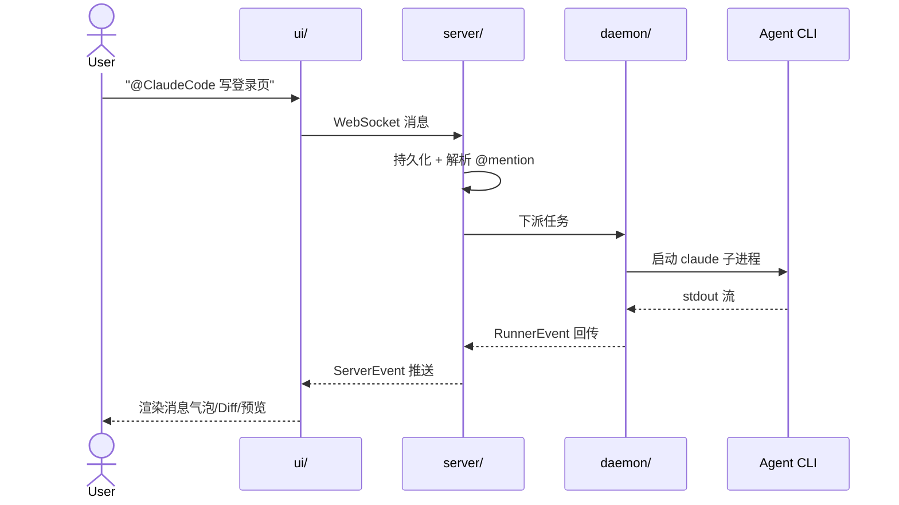
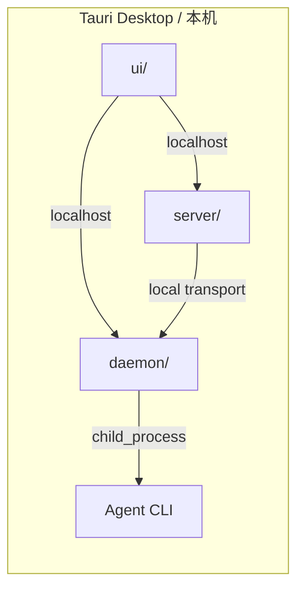
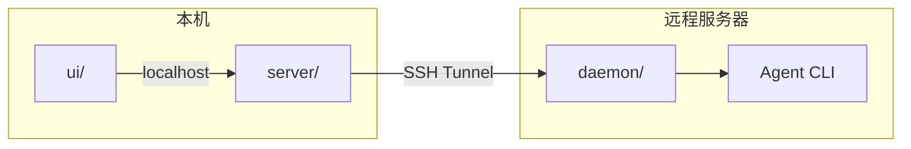
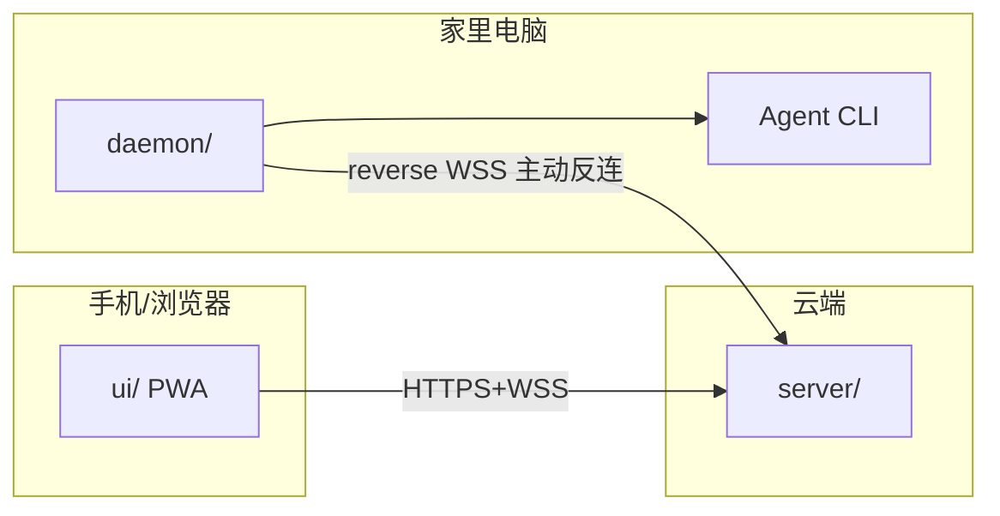
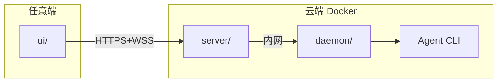
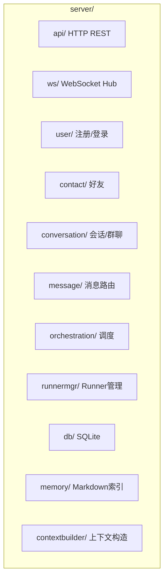
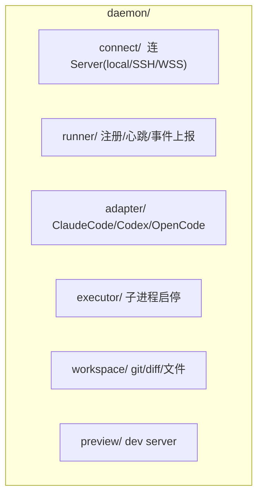
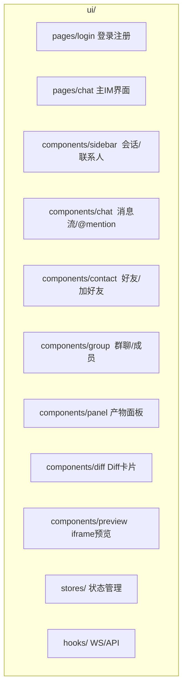

# AgentHub 项目架构

## 目录结构

```
AgentHub/
├── ui/                     # React 前端
├── server/                 # 中心 IM Server（Go）
├── daemon/                 # 本地 Daemon（Go）
├── protocol/               # 共享 TS 类型定义
├── docs/                   # 产品文档 + 调研报告
└── .agenthub/              # 项目自身的 Memory/规则
```

## 角色定义

| 角色 | 目录 | 职责 |
|------|------|------|
| **IM Server** | `server/` | 用户注册登录 / 联系人好友 / 单聊群聊 / 消息路由中转 / WebSocket Hub / 多端同步 / Orchestrator 调度 |
| **本地 Daemon** | `daemon/` | 连中心 Server / 管理 Runner / workspace / git / Preview / 进程生命周期 |
| **Runner** | `daemon/` 内部管理 | 启动 Agent CLI 子进程 / 采集 stdout / 生成事件 |
| **Agent** | 系统外 CLI | Claude Code / Codex / OpenCode |
| **UI** | `ui/` | IM 聊天界面 / 会话列表 / 产物面板 / Diff 卡片 |

## 总架构



## 消息流：用户发消息到 Agent 回复



**消息永远经过 server。daemon 不存消息，不直连 UI。**

## 四种部署拓扑

### P0 Desktop 全本地



Desktop UI 同时连 Server（IM 消息）和 Daemon（高频数据：日志/文件/Preview）。Server 负责 IM 中枢，Daemon 负责执行。

### P1 Desktop + SSH 远程 Runner



本机只跑 UI 和 Server，重活交给远程 daemon。

### P2 Web/Mobile 远程控制



移动端只做控制台。家里电脑的 daemon 主动反连云端 Server。

### P3 全云端



## server/ 内部



## daemon/ 内部



## ui/ 内部



## 协议层

`protocol/` 先于所有代码。每个模块生成时必须读。

```
protocol/
├── index.ts
├── user.ts              # User / Auth
├── contact.ts           # Contact / FriendRequest
├── conversation.ts      # Conversation / Message / Thread
├── agent.ts             # Agent / AgentAdapter / AgentSession
├── runner.ts            # RunnerCommand / RunnerEvent
├── server-event.ts      # ServerEvent (WebSocket 推送)
├── artifact.ts          # Artifact / DiffArtifact
└── memory.ts            # MemoryDocument
```

## 端口

| 服务 | 地址 |
|------|------|
| Web UI | 127.0.0.1:3000 |
| Server API | 127.0.0.1:3210 |
| WebSocket | ws://127.0.0.1:3210/ws |
| Daemon | 127.0.0.1:39731 |
| Preview | 127.0.0.1:5100-5199 |

## 核心原则

- **server 是 IM 中枢**：所有用户、消息、联系人、群聊经过它
- **daemon 是执行桥梁**：连 center + 管 Runner + workspace + preview
- **UI 只连 Server**：消息/联系人/群聊走 Server，高频数据（日志/Preview）可本地直连 daemon
- **daemon 不存消息**：消息持久化只在 server
- **daemon 默认不暴露公网**：127.0.0.1、SSH tunnel、reverse WSS
