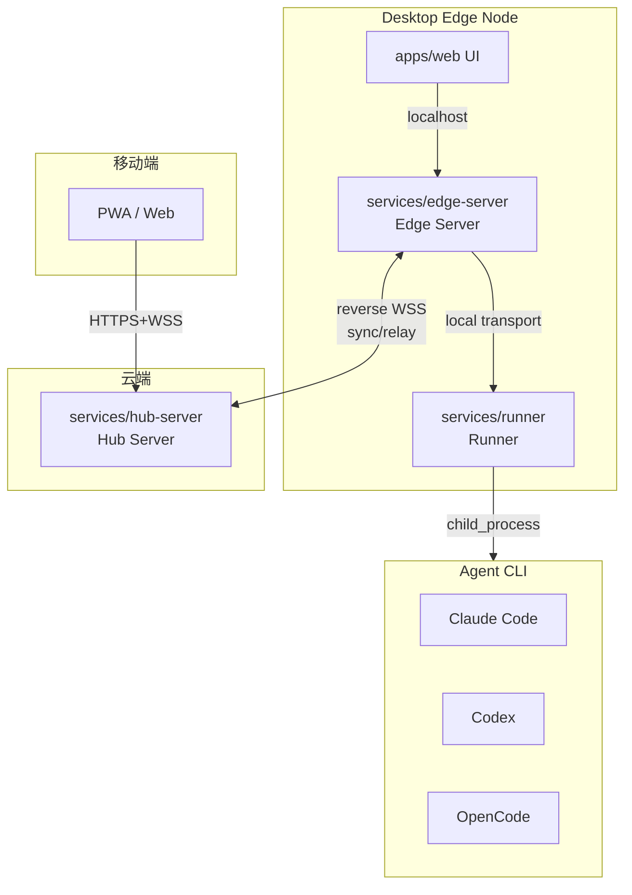
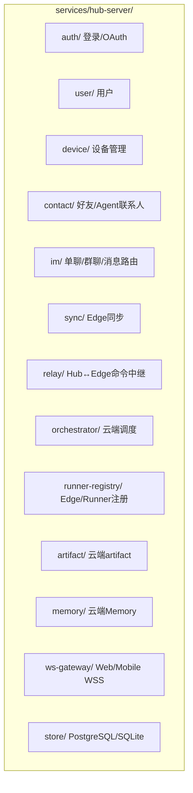
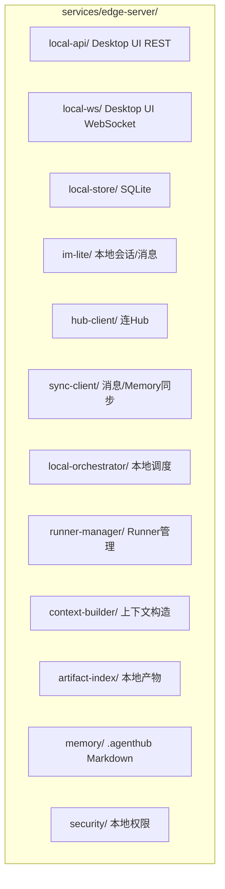
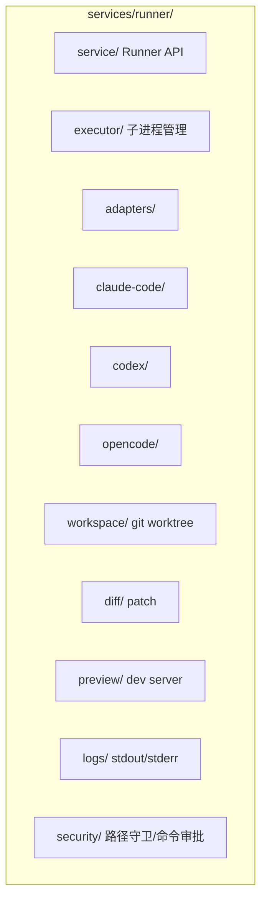
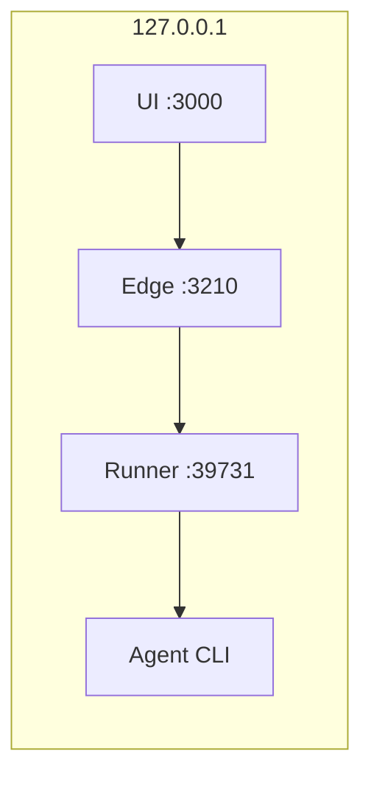
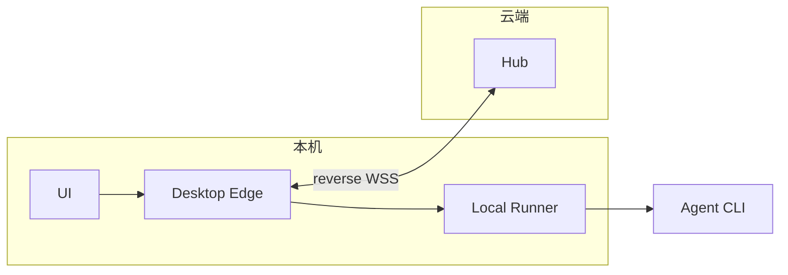
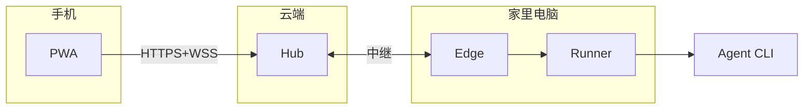
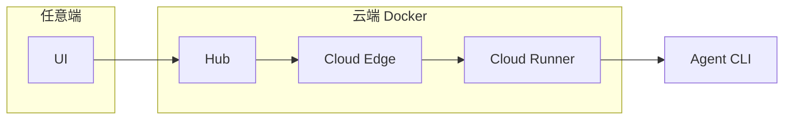
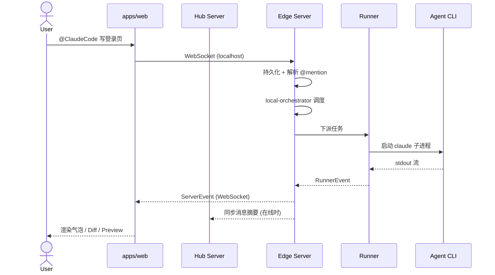
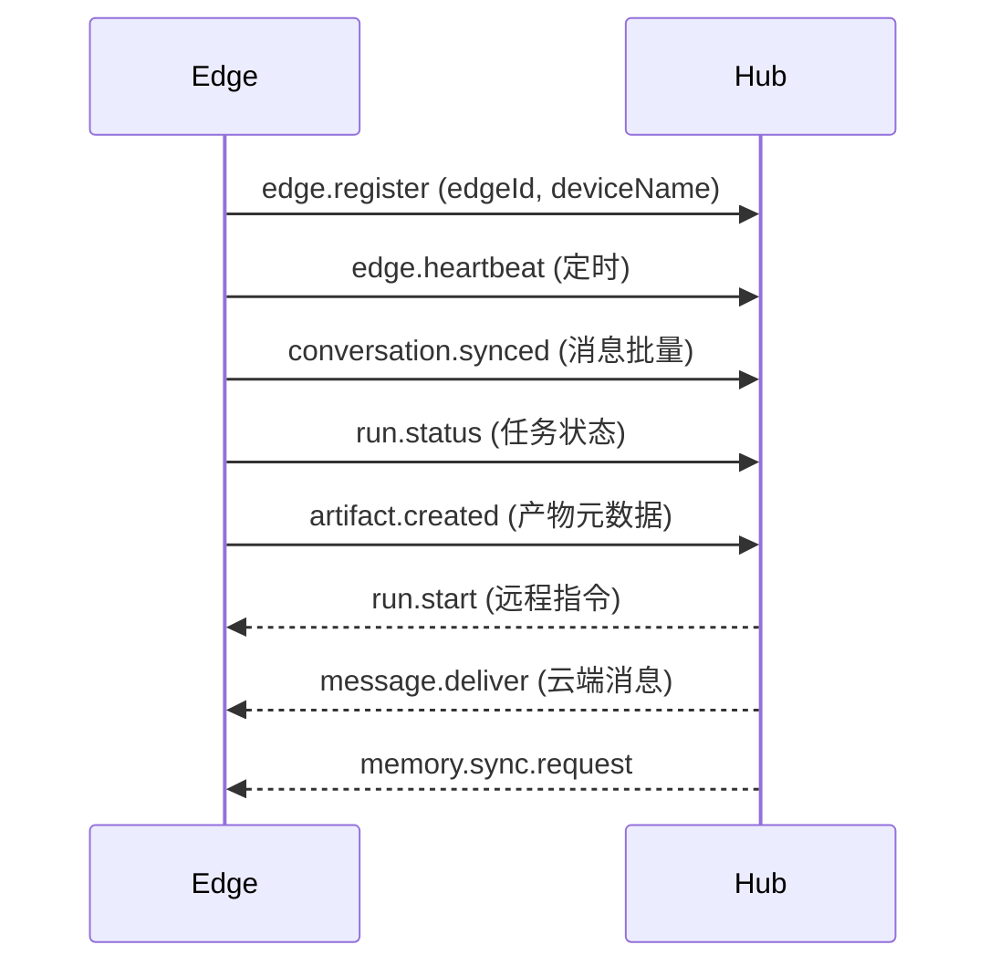

# AgentHub Architecture

## Hub-Edge-Runner 架构总览



## 三个核心角色

### Hub Server（中心 IM Server）



**Hub 是中心控制面和云端 IM 权威**：用户账号、好友关系、云端群聊、多端同步、Edge 节点注册、权限和远程控制中继。

### Edge Server（边缘控制节点）



**Edge 是边缘控制节点**：运行在 Desktop、远程机器或云端节点上，负责本地/边缘会话、项目 Memory、Context 构造、Runner 管理、连 Hub 同步。离线可独立运行。

### Runner（执行节点）



**Runner 只管执行**：启动 Agent CLI、读写 workspace、生成 Diff、启动 Preview。不存消息，不管 IM。

## 四种部署模式

下面四种模式是简化视角。更完整的 Desktop/Web、Desktop/Cloud Runner、SSH/Tailscale 直连、Hub Relay 中继拓扑见 [topology.md](topology.md)。

### P0 Desktop 本地离线



Desktop 本机包含 UI + Edge + Runner。Hub 在离线模式下不参与；如果开发时启动本地 Hub，它只作为中心服务的本地开发形态。

### P1 Desktop + Hub 同步



Edge 主动连云端 Hub。手机可查看状态，消息云端备份。本地执行不受影响。

### P2 移动远程控制



手机发指令 → Hub 中继 → 家里 Edge → Runner 执行。结果原路返回。

### P3 全云端



全部跑在云端 Docker 里。不需要本机。

## 消息流完整链路



## Hub ↔ Edge 同步协议

Edge 主动连接 Hub（reverse WSS），保持长连接。



## 数据归属

| 数据 | Edge | Hub | Runner |
|------|:----:|:---:|:------:|
| 本地消息 | **主存** | 同步副本 | - |
| 云端群聊 | 缓存 | **主存** | - |
| 好友关系 | 缓存 | **主存** | - |
| Agent 联系人 | 缓存 | **主存** | - |
| 项目 .agenthub/ | **主索引** | 同步索引 | 读写文件 |
| Artifact 元数据 | **主存** | 同步 | 产生 |
| Diff / 日志文件 | 索引 | 可选同步 | **主存** |
| workspace 文件 | 索引 | - | **主存** |
| Runner 进程 | 管理 | 镜像状态 | **主状态** |

## 权威模型

为避免本地、远程和云端场景混乱，每个会话必须显式区分两个权威：

```ts
type ConversationAuthority =
  | { type: "edge"; edgeId: string }
  | { type: "hub"; hubId: string }

type ExecutionAuthority = {
  edgeId: string
  runnerId: string
  workspaceId: string
}
```

- **Conversation Authority**：谁保存消息、群聊、Thread 的主副本。
- **Execution Authority**：任务实际在哪个 Edge/Runner/workspace 执行。

本地离线时二者通常都在本机 Desktop Edge；Web 远程控制 Desktop 时，Conversation Authority 通常在 Hub，Execution Authority 在目标 Desktop Edge。

## 共享包

| 包 | 语言 | 用途 |
|---|---|---|
| `packages/protocol/` | Schema + generated TypeScript/Go | schema-first 共享协议，生成 UI/Hub/Edge/Runner 类型，详见 [protocol.md](protocol.md) |
| `packages/transport/` | Model + interfaces | local / ssh / tailscale / hub-relay 路由模型、resolver 和 client interface |
| `packages/im-core/` | Go | Conversation/Message/Thread 共享逻辑 |
| `packages/agent-core/` | Go | Project / Thread / Turn / Item / AgentRun 共享模型 |
| `packages/workspace-core/` | Go | workspace / worktree / patch 元数据 |
| `packages/approval-core/` | Go | ApprovalRequest / ApprovalDecision / policy 元数据 |
| `packages/sync-core/` | Go | EdgeEvent / Sync / Ack / Relay 协议 |
| `packages/memory-core/` | Go | Memory/ContextBuilder 共享逻辑 |
| `packages/artifact-core/` | Go | Artifact 类型和索引 |
| `packages/adapters/` | Go | ClaudeCode/Codex/OpenCode 适配层 |
| `packages/ui-kit/` | React | 共享 UI 组件 |

## 端口

| 服务 | 地址 |
|------|------|
| Web UI | 127.0.0.1:3000 |
| Edge Server | 127.0.0.1:3210 |
| Hub Server | 127.0.0.1:3211 (本地开发) / 云端域名 |
| Runner | 127.0.0.1:39731 |
| Preview | 127.0.0.1:5100-5199 |

## 核心原则

- **Hub 是中心控制面**：账号、好友、云端群聊、多端同步、权限和中继由 Hub 负责
- **Edge 是边缘控制节点**：本地/边缘会话、项目、Memory、Context、Runner、workspace、preview 由 Edge 管理
- **Runner 只管执行**：不存消息、不管 IM、不做 Memory
- **Go-first services**：Hub、Edge、Runner 从 P0 起使用 Go 实现，TypeScript 只用于 UI 和生成类型
- **Desktop Command Center first**：P0 优先 Project / Thread / Worktree / Diff / Approval / Preview，而不是完整 Hub 好友/群聊
- **Protocol schema-first**：JSON Schema / OpenAPI / AsyncAPI 是唯一协议源头，TypeScript 与 Go 类型均由 schema 生成
- **Authority 显式建模**：消息写入、执行、Artifact、Memory 的权威归属见 [authority.md](authority.md)
- **Data Plane 受 Edge 授权**：UI 不直接访问远程 Runner，本地 Fast Path 需要 Edge 短期 token，见 [data-plane.md](data-plane.md)
- **凡是能跑 Runner 的机器都是 Edge Node**：Desktop、远程电脑、实验室机器、Cloud VM 都统一建模为 Edge
- **远程执行统一走 Edge**：不要让 UI 直接打远程 Runner
- **UI 默认连 Edge**（Desktop），Web/Mobile 连 Hub
- **Edge 主动连 Hub**：reverse WSS，Hub 不直连用户本机
- **离线可用**：Edge + Runner 可脱离 Hub 独立工作
