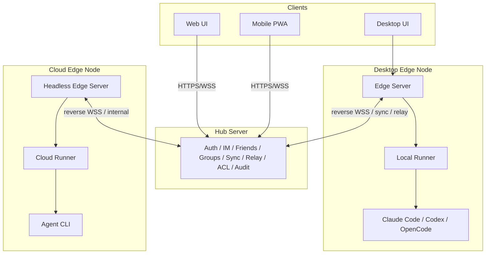

# AgentHub Topology

Date: 2026-05-21

## 1. Roles

AgentHub uses a **Hub - Edge - Runner** architecture.

| Role | Deploys On | Responsibility |
|---|---|---|
| **AgentHub UI** | Desktop / Web / Mobile | IM interface, message stream, artifact panel, diff/preview cards |
| **Hub Server** | Public cloud / central server | Account, global IM, friends, groups, multi-device sync, relay, permissions, audit |
| **Edge Server** | Desktop / cloud node / remote machine | Local control node: projects, memory, context builder, runner manager, artifact index |
| **Runner** | Same machine as an Edge node | Execute Claude Code / Codex / OpenCode, manage workspace, logs, diff, preview |
| **CLI Agent** | External process | Claude Code, Codex, OpenCode |
| **Transport** | local / ssh / tailscale / hub-relay | Connect UI, Hub, Edge and Runner |

Key rule:

> Any machine that can run a Runner should be modeled as an **Edge Node**.

Examples:

| Machine | Node Type |
|---|---|
| User laptop | Desktop Edge Node |
| Classmate's desktop | Remote Desktop Edge Node |
| Lab Linux machine | Remote Edge Node |
| Cloud VM / Docker host | Cloud Edge Node |

## 2. Final Topology



Short form:

```text
Desktop = UI + Edge Server + Local Runner + CLI Agent
Cloud Node = Headless Edge Server + Cloud Runner + CLI Agent
Hub Server = central IM + account + sync + relay + remote control
```

## 2.1 Multica Mapping

Multica is a Tier-0 reference for managed agent lifecycle, but AgentHub splits the responsibilities differently because the core UX is IM-first and every executable machine is modeled as an Edge Node.

| Multica Concept | AgentHub Mapping | Note |
|---|---|---|
| Server | Hub Server + Edge Server split | Hub owns central IM/sync/relay; Edge owns local project, context, runner and artifact authority |
| Daemon | Edge-managed local execution capability | AgentHub should expose it as Edge health plus Runner availability, not as a user-facing daemon concept |
| Runtime | RunnerEndpoint / AgentCapability | A runtime means where a CLI agent can run and which CLI/provider is available |
| Task queue | AgentRun queue | Use queued/running/awaiting_approval/done/failed/cancelled states |
| WebSocket progress | EdgeEvent / RunnerEvent | Progress must be typed and replayable through EventStore, not just transient socket text |
| Agent as teammate | AgentProfile + Conversation actor | Human/agent/system actors should appear consistently in chat, artifacts, approvals and run history |
| Issue board | Optional imported work source | AgentHub's first object remains Conversation / Thread / Artifact, not Issue / Board |

## 3. Network Planes

### Control Plane

The control plane handles commands, scheduling, status and permissions.

```text
UI -> Edge Server
UI -> Hub Server
Hub Server -> Edge Server
Edge Server -> Runner
```

Control-plane events include:

- send message
- create conversation
- parse `@Agent`
- orchestrator scheduling
- start / stop run
- approve command
- runner heartbeat
- run status
- permission check

### Data Plane

The data plane handles large or latency-sensitive data.

```text
UI -> nearest Edge
UI -> Local Runner Fast Path only when authorized
UI -> Hub proxy fallback
```

Data-plane resources include:

- log stream
- file read
- diff content
- preview iframe
- large artifact download

Principles:

- UI does not directly access remote Runner.
- UI may access Local Runner only through a short-lived token issued by Edge.
- Remote Desktop / Cloud data plane must go through Remote Edge or Hub proxy.
- If Web/Mobile or NAT traversal is involved, use Hub relay/proxy.

### Sync Plane

The sync plane mirrors state between Edge and Hub.

```text
Edge Server <-> Hub Server
```

Sync content:

- message summary
- run status
- artifact metadata
- preview route
- memory index
- conversation summary
- device status

Large logs, large files and workspace contents are not synced by default.

## 4. Supported Topologies

| Scenario | UI Connection | Control Path | Execution | Hub Required | Recommended Use |
|---|---|---|---|---|---|
| 1. Desktop local offline | Desktop UI -> Local Edge | Edge -> Local Runner | local machine | No | Offline development, course demo |
| 2. Desktop local online | Desktop UI -> Local Edge | Edge -> Local Runner, Edge <-> Hub sync | local machine | Optional | Local execution + cloud sync |
| 3. Desktop direct to remote Desktop | Desktop UI -> Local Edge | Local Edge -> Remote Edge -> Remote Runner | remote desktop | No | LAN / SSH / Tailscale remote execution |
| 4. Desktop relay to remote Desktop | Desktop UI -> Local Edge or Hub | Local Edge/Hub -> Hub Relay -> Remote Edge -> Runner | remote desktop | Yes | NAT traversal remote execution |
| 5. Desktop direct to Cloud | Desktop UI -> Local Edge | Local Edge -> Cloud Edge -> Cloud Runner | cloud server | No | High-performance cloud execution |
| 6. Desktop relay to Cloud | Desktop UI -> Local Edge or Hub | Hub -> Cloud Edge -> Cloud Runner | cloud server | Yes | Hosted cloud runner |
| 7. Web relay to Desktop | Web UI -> Hub | Hub -> Desktop Edge -> Local Runner | user desktop | Yes | Browser/mobile remote control |
| 8. Web relay to Cloud | Web UI -> Hub | Hub -> Cloud Edge -> Cloud Runner | cloud server | Yes | SaaS / public demo |

All scenarios reduce to three transport classes:

```text
local   = same-machine connection
direct  = SSH / Tailscale / LAN connection
relay   = Hub Server relay
```

## 5. Scenario Details

### 1. Desktop Local Offline

```text
Desktop UI
  -> Local Edge Server
  -> Local Runner
  -> Claude Code / Codex / OpenCode
```

- Hub does not participate.
- Local SQLite is the message store.
- `.agenthub/` is local project memory.
- Local preview and local artifacts work offline.

Authority:

```text
Conversation authority = edge
Execution authority = local runner
```

### 2. Desktop Local Online

```text
Desktop UI
  -> Local Edge Server
  -> Local Runner
  -> Agent CLI

Local Edge Server <-> Hub Server
```

Hub handles login, device registration, message summary sync, artifact metadata sync, remote status view and notifications.

Authority:

```text
Conversation authority = edge
Sync target = hub
```

### 3. Desktop Direct to Remote Desktop Edge

```text
Local Desktop UI
  -> Local Edge Server
  -> SSH/Tailscale
  -> Remote Desktop Edge Server
  -> Remote Runner
  -> Remote Agent CLI
```

Do not model this as direct-to-Runner. The remote machine should also run an Edge Server because the remote Edge owns permissions, workspace roots, runner status and artifact index.

### 4. Desktop Relay to Remote Desktop Edge

```text
Local Desktop UI
  -> Local Edge Server
  -> Hub Server Relay
  -> reverse WSS
  -> Remote Desktop Edge Server
  -> Remote Runner
  -> Agent CLI
```

The remote Desktop Edge connects out to Hub:

```bash
agenthub-edge connect --hub https://hub.example.com --token edge_xxx
```

This works when the remote machine has no public IP or inbound port.

### 5. Desktop Direct to Cloud Edge

```text
Desktop UI
  -> Local Edge Server
  -> SSH/Tailscale
  -> Cloud Edge Server
  -> Cloud Runner
  -> Agent CLI
```

Cloud Runner should not be a naked process. Model it as:

```text
Cloud Node = Cloud Edge Server + Cloud Runner + CLI Agent
```

### 6. Desktop Relay to Cloud Edge

```text
Desktop UI
  -> Local Edge Server or Hub
  -> Hub Server
  -> Cloud Edge Server
  -> Cloud Runner
  -> Agent CLI
```

Hub can select a cloud Edge, check permission, dispatch `run.start`, receive `run.status` / artifact metadata, and push updates back to Desktop.

### 7. Web Relay to Desktop Edge

```text
Web UI
  -> HTTPS/WSS
  -> Hub Server
  -> reverse WSS
  -> Desktop Edge Server
  -> Local Runner
  -> Agent CLI
```

Web cannot directly access a user's local Edge. It must go through Hub relay.

Requirements:

- Desktop Edge keeps an outbound connection to Hub.
- Hub shows device online/offline state.
- Remote commands have permission checks and audit logs.

### 8. Web Relay to Cloud Edge

```text
Web UI
  -> Hub Server
  -> Cloud Edge Server
  -> Cloud Runner
  -> Agent CLI
```

This is the SaaS-style topology.

## 6. Authority Model

Detailed authority and write rules are defined in [authority.md](authority.md). This section keeps only the topology-level summary.

### Conversation Authority

Conversation Authority decides who owns the primary copy of messages, group membership and threads.

```ts
type ConversationAuthority =
  | { type: "edge"; edgeId: string }
  | { type: "hub"; hubId: string }
```

### Execution Authority

Execution Authority decides where the task runs.

```ts
type ExecutionAuthority = {
  edgeId: string
  runnerId: string
  workspaceId: string
}
```

Examples:

```json
{
  "conversationAuthority": { "type": "edge", "edgeId": "desktop-a" },
  "executionAuthority": {
    "edgeId": "desktop-a",
    "runnerId": "local-runner",
    "workspaceId": "workspace-agenthub"
  }
}
```

```json
{
  "conversationAuthority": { "type": "hub", "hubId": "hub-main" },
  "executionAuthority": {
    "edgeId": "desktop-b",
    "runnerId": "local-runner",
    "workspaceId": "workspace-demo"
  }
}
```

```json
{
  "conversationAuthority": { "type": "hub", "hubId": "hub-main" },
  "executionAuthority": {
    "edgeId": "cloud-node-1",
    "runnerId": "cloud-runner-1",
    "workspaceId": "workspace-cloud-demo"
  }
}
```

## 7. Route Resolution

Do not hardcode each topology. Use a route model.

```ts
type TransportKind = "local" | "ssh" | "tailscale" | "hub-relay"

type EdgeNode = {
  id: string
  name: string
  kind: "desktop" | "cloud" | "server" | "lab"
  ownerUserId: string
  online: boolean
  capabilities: string[]
  directEndpoints?: {
    tailscale?: string
    lan?: string
    ssh?: string
  }
  hubRelayEnabled: boolean
}

type RunnerEndpoint = {
  id: string
  edgeId: string
  kind: "local" | "remote" | "cloud"
  adapters: ("claude-code" | "codex" | "opencode")[]
  workspaceRoots: string[]
  status: "online" | "offline" | "busy"
}

type AgentRoute = {
  source: {
    uiKind: "desktop" | "web" | "mobile"
    edgeId?: string
  }
  target: {
    edgeId: string
    runnerId: string
    workspaceId: string
  }
  transport: TransportKind
}
```

Route resolver priority:

```text
local > tailscale > ssh > hub-relay
```

Reasoning:

- `local` has the lowest latency.
- `tailscale` is the best direct multi-device UX.
- `ssh` is explicit and reliable for self-managed machines.
- `hub-relay` has the broadest reach and works behind NAT.

## 8. Edge-Hub Sync

Edge keeps a local event log.

```ts
type EdgeEvent = {
  id: string
  edgeId: string
  seq: number
  type:
    | "message.created"
    | "run.started"
    | "run.status.changed"
    | "artifact.created"
    | "memory.updated"
    | "summary.updated"
  payload: unknown
  createdAt: string
  syncStatus: "pending" | "synced" | "failed"
}
```

Sync flow:

```text
Edge -> Hub:
  upload edge events

Hub -> Edge:
  deliver remote commands
  deliver remote messages
  deliver sync ack
```

Reconnect:

```text
Hub stores lastAckSeq.
Edge reconnects and uploads from lastAckSeq + 1.
```

## 9. Hub Relay Protocol

Edge connects out to Hub through reverse WebSocket.

```ts
type EdgeToHubEvent =
  | { type: "edge.register"; edgeId: string; deviceName: string; capabilities: string[] }
  | { type: "edge.heartbeat"; edgeId: string; runners: RunnerStatus[] }
  | { type: "sync.events"; edgeId: string; events: EdgeEvent[] }
  | { type: "run.event"; edgeId: string; runId: string; event: RunnerEvent }
  | { type: "artifact.metadata"; edgeId: string; artifact: Artifact }

type HubToEdgeCommand =
  | { type: "run.start"; targetRunnerId: string; command: RunnerCommand }
  | { type: "run.stop"; runId: string }
  | { type: "message.deliver"; conversationId: string; message: Message }
  | { type: "sync.ack"; edgeId: string; lastSeq: number }
  | { type: "preview.request"; runId: string }
```

## 10. Preview And Artifact Routing

Detailed data-plane rules are defined in [data-plane.md](data-plane.md). This section keeps only the route vocabulary.

Preview routes:

```ts
type PreviewRoute =
  | { mode: "local"; url: "http://127.0.0.1:5173" }
  | { mode: "direct"; url: "http://100.x.x.x:5173" }
  | { mode: "ssh-tunnel"; localUrl: "http://127.0.0.1:5173" }
  | { mode: "hub-proxy"; url: "https://hub.example.com/preview/run_123" }
```

| Scenario | Preview Mode |
|---|---|
| Desktop local | `local` |
| Desktop -> SSH remote | `ssh-tunnel` |
| Desktop -> Tailscale remote | `direct` |
| Web -> Desktop | `hub-proxy` |
| Web -> Cloud | `hub-proxy` or `direct` |
| Mobile -> Desktop | `hub-proxy` |

Artifact location:

```ts
type ArtifactLocation =
  | { type: "edge-local"; edgeId: string; path: string }
  | { type: "hub-cache"; url: string }
  | { type: "object-storage"; url: string }
```

Principles:

- Artifact metadata syncs to Hub.
- Large content is fetched on demand.
- Small high-value artifacts may be cached by Hub.
- Workspace content is not uploaded by default.

## 11. Module Reuse

Hub and Edge should not duplicate IM logic.

```text
packages/im-core
  conversation model
  message model
  thread model
  mention parser

packages/memory-core
  project memory
  conversation summary
  context builder
  pinned messages

packages/artifact-core
  artifact model
  preview route
  diff metadata
```

Edge uses:

```text
im-core + memory-core + artifact-core + runner-manager + hub-client
```

Hub uses:

```text
im-core + memory-core + artifact-core + auth + sync + relay + device-registry
```

Runner uses:

```text
protocol + adapters + workspace + artifact-core
```

## 12. Final Architecture Statement

```text
AgentHub = Hub-Edge-Runner architecture

Desktop is not just a client:
Desktop = UI + Edge Server + Local Runner + CLI Agent

Hub Server is central IM and relay:
Hub = Auth + Friends + Groups + Sync + Relay + Permissions

Cloud Runner is not naked:
Cloud Node = Headless Edge Server + Cloud Runner + CLI Agent

Web / Mobile connect to Hub:
Web/Mobile -> Hub -> Edge -> Runner

Desktop defaults to local Edge:
Desktop UI -> Local Edge -> Local Runner

All remote execution uses:
source UI -> authority server -> target Edge -> target Runner
```

This design covers all long-term topologies from day one, while implementation can still start with:

```text
Desktop UI -> Local Edge Server -> Local Runner
```

The code should reserve:

- Hub Server
- Edge-Hub reverse WSS
- Transport abstraction
- Route Resolver
- Conversation Authority
- Execution Authority
- Artifact / Preview routing
