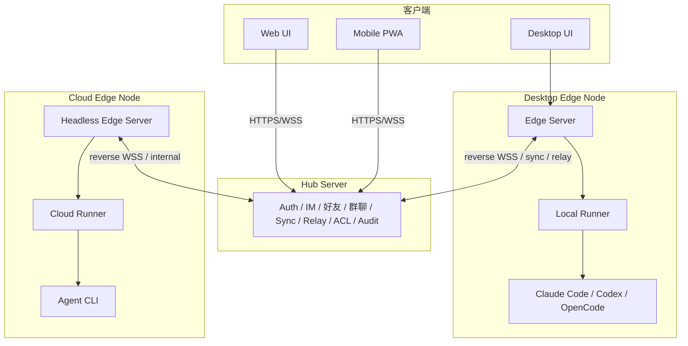

# AgentHub 拓扑

日期：2026-05-21

## 1. 角色

AgentHub 使用 **Hub - Edge - Runner** 架构。

| 角色 | 部署位置 | 职责 |
|---|---|---|
| **AgentHub UI** | Desktop / Web / Mobile | IM 界面、消息流、产物面板、diff/preview 卡片 |
| **Hub Server** | 公网 / 中心服务器 | 账号、全局 IM、好友、群聊、多端同步、中继、权限、审计 |
| **Edge Server** | Desktop / 云端节点 / 远程机器 | 本地控制节点：项目、memory、上下文构造、runner 管理、产物索引 |
| **Runner** | 与 Edge 节点同机 | 执行 Claude Code / Codex / OpenCode，管理 workspace、日志、diff、preview |
| **CLI Agent** | 外部进程 | Claude Code、Codex、OpenCode |
| **Transport** | local / ssh / tailscale / hub-relay | 连接 UI、Hub、Edge 和 Runner |

核心规则：

> 任何能运行 Runner 的机器都应建模为 **Edge Node**。

示例：

| 机器 | 节点类型 |
|---|---|
| 用户笔记本 | Desktop Edge Node |
| 同学台式机 | Remote Desktop Edge Node |
| 实验室 Linux 机器 | Remote Edge Node |
| Cloud VM / Docker host | Cloud Edge Node |

## 2. 最终拓扑



简写：

```text
Desktop = UI + Edge Server + Local Runner + CLI Agent
Cloud Node = Headless Edge Server + Cloud Runner + CLI Agent
Hub Server = 中心 IM + 账号 + 同步 + 中继 + 远程控制
```

## 2.1 Multica 映射

Multica 是 managed agent lifecycle 的 Tier-0 参考，但 AgentHub 拆分职责的方式不同，因为核心 UX 是 IM-first，且每台可执行机器都建模为 Edge Node。

| Multica 概念 | AgentHub 映射 | 说明 |
|---|---|---|
| Server | Hub Server + Edge Server 拆分 | Hub 拥有中心 IM/sync/relay；Edge 拥有本地项目、上下文、runner 和产物权威 |
| Daemon | Edge 管理的本地执行能力 | AgentHub 将其暴露为 Edge 健康状态 + Runner 可用性，不作为用户可见的 daemon 概念 |
| Runtime | RunnerEndpoint / AgentCapability | Runtime 表示 CLI agent 可以在哪里运行以及哪个 CLI/provider 可用 |
| Task queue | AgentRun queue | 使用 queued/running/awaiting_approval/done/failed/cancelled 状态 |
| WebSocket progress | EdgeEvent / RunnerEvent | 进度必须通过 EventStore 类型化和可回放，不只是瞬时的 socket 文本 |
| Agent as teammate | AgentProfile + Conversation actor | 人类/agent/system actor 应在聊天、产物、审批和运行历史中一致出现 |
| Issue board | 可选的外部工作源 | AgentHub 的首要对象仍是 Conversation / Thread / Artifact，不是 Issue / Board |

## 3. 网络三面

### 控制面

控制面处理命令、调度、状态和权限。

```text
UI -> Edge Server
UI -> Hub Server
Hub Server -> Edge Server
Edge Server -> Runner
```

控制面事件包括：

- 发送消息
- 创建会话
- 解析 `@Agent`
- orchestrator 调度
- 启动 / 停止 run
- 审批命令
- runner 心跳
- run 状态
- 权限检查

### 数据面

数据面处理大流量或延迟敏感的数据。

```text
UI -> 最近的 Edge
UI -> Local Runner Fast Path，仅在授权时
UI -> Hub proxy 兜底
```

数据面资源包括：

- 日志流
- 文件读取
- diff 内容
- preview iframe
- 大产物下载

原则：

- UI 不直接访问远程 Runner。
- UI 只能通过 Edge 签发的短期 token 访问 Local Runner。
- 远程 Desktop / Cloud 的数据面必须经过 Remote Edge 或 Hub proxy。
- Web/Mobile 或涉及 NAT 穿透时，使用 Hub relay/proxy。

### 同步面

同步面在 Edge 和 Hub 之间镜像状态。

```text
Edge Server <-> Hub Server
```

同步内容：

- 消息摘要
- run 状态
- artifact 元数据
- preview 路由
- memory 索引
- 会话摘要
- 设备状态

大日志、大文件和 workspace 内容默认不同步。

## 4. 支持的拓扑

| 场景 | UI 连接方式 | 控制路径 | 执行位置 | 需要 Hub | 推荐用途 |
|---|---|---|---|---|---|
| 1. Desktop 本地离线 | Desktop UI -> Local Edge | Edge -> Local Runner | 本机 | 否 | 离线开发、课程 demo |
| 2. Desktop 本地在线 | Desktop UI -> Local Edge | Edge -> Local Runner, Edge <-> Hub sync | 本机 | 可选 | 本地执行 + 云端同步 |
| 3. Desktop 直连远程 Desktop | Desktop UI -> Local Edge | Local Edge -> Remote Edge -> Remote Runner | 远程桌面 | 否 | LAN / SSH / Tailscale 远程执行 |
| 4. Desktop 中继到远程 Desktop | Desktop UI -> Local Edge or Hub | Local Edge/Hub -> Hub Relay -> Remote Edge -> Runner | 远程桌面 | 是 | NAT 穿透远程执行 |
| 5. Desktop 直连云 | Desktop UI -> Local Edge | Local Edge -> Cloud Edge -> Cloud Runner | 云端服务器 | 否 | 高性能云端执行 |
| 6. Desktop 中继到云 | Desktop UI -> Local Edge or Hub | Hub -> Cloud Edge -> Cloud Runner | 云端服务器 | 是 | 托管云 runner |
| 7. Web 中继到 Desktop | Web UI -> Hub | Hub -> Desktop Edge -> Local Runner | 用户桌面 | 是 | 浏览器/手机远程控制 |
| 8. Web 中继到云 | Web UI -> Hub | Hub -> Cloud Edge -> Cloud Runner | 云端服务器 | 是 | SaaS / 公开 demo |

所有场景归结为三种传输类型：

```text
local   = 同机连接
direct  = SSH / Tailscale / LAN 连接
relay   = Hub Server 中继
```

## 5. 场景详解

### 1. Desktop 本地离线

```text
Desktop UI
  -> Local Edge Server
  -> Local Runner
  -> Claude Code / Codex / OpenCode
```

- Hub 不参与。
- 本地 SQLite 是消息存储。
- `.agenthub/` 是本地项目 memory。
- 本地 preview 和 artifact 离线可用。

权威归属：

```text
Conversation authority = edge
Execution authority = local runner
```

### 2. Desktop 本地在线

```text
Desktop UI
  -> Local Edge Server
  -> Local Runner
  -> Agent CLI

Local Edge Server <-> Hub Server
```

Hub 负责登录、设备注册、消息摘要同步、artifact 元数据同步、远程状态查看和通知。

权威归属：

```text
Conversation authority = edge
Sync target = hub
```

### 3. Desktop 直连远程 Desktop Edge

```text
Local Desktop UI
  -> Local Edge Server
  -> SSH/Tailscale
  -> Remote Desktop Edge Server
  -> Remote Runner
  -> Remote Agent CLI
```

不要建模为直连 Runner。远程机器上也应运行 Edge Server，因为远程 Edge 拥有权限、workspace 根路径、runner 状态和 artifact 索引。

### 4. Desktop 中继到远程 Desktop Edge

```text
Local Desktop UI
  -> Local Edge Server
  -> Hub Server Relay
  -> reverse WSS
  -> Remote Desktop Edge Server
  -> Remote Runner
  -> Agent CLI
```

远程 Desktop Edge 主动连接 Hub：

```bash
agenthub-edge connect --hub https://hub.example.com --token edge_xxx
```

这适用于远程机器没有公网 IP 或入站端口的情况。

### 5. Desktop 直连 Cloud Edge

```text
Desktop UI
  -> Local Edge Server
  -> SSH/Tailscale
  -> Cloud Edge Server
  -> Cloud Runner
  -> Agent CLI
```

Cloud Runner 不应该是裸进程。建模为：

```text
Cloud Node = Cloud Edge Server + Cloud Runner + CLI Agent
```

### 6. Desktop 中继到 Cloud Edge

```text
Desktop UI
  -> Local Edge Server or Hub
  -> Hub Server
  -> Cloud Edge Server
  -> Cloud Runner
  -> Agent CLI
```

Hub 可以选择 cloud Edge、检查权限、下发 `run.start`、接收 `run.status` / artifact 元数据，并将更新推回 Desktop。

### 7. Web 中继到 Desktop Edge

```text
Web UI
  -> HTTPS/WSS
  -> Hub Server
  -> reverse WSS
  -> Desktop Edge Server
  -> Local Runner
  -> Agent CLI
```

Web 不能直接访问用户的本地 Edge，必须通过 Hub 中继。

要求：

- Desktop Edge 保持到 Hub 的出站连接。
- Hub 显示设备在线/离线状态。
- 远程命令有权限检查和审计日志。

### 8. Web 中继到 Cloud Edge

```text
Web UI
  -> Hub Server
  -> Cloud Edge Server
  -> Cloud Runner
  -> Agent CLI
```

这是 SaaS 形态的拓扑。

## 6. 权威模型

详细的权威和写入规则见 [authority.md](authority.md)。本节只保留拓扑层面的摘要。

### Conversation Authority

Conversation Authority 决定谁拥有消息、群组成员和 thread 的主副本。

```ts
type ConversationAuthority =
  | { type: "edge"; edgeId: string }
  | { type: "hub"; hubId: string }
```

### Execution Authority

Execution Authority 决定任务在哪里运行。

```ts
type ExecutionAuthority = {
  edgeId: string
  runnerId: string
  workspaceId: string
}
```

示例：

```json
{
  "conversationAuthority": { "type": "edge", "edgeId": "desktop-a" },
  "executionAuthority": {
    "edgeId": "desktop-a",
    "runnerId": "local-runner",
    "workspaceId": "workspace-agenthub"
  }
}
```

```json
{
  "conversationAuthority": { "type": "hub", "hubId": "hub-main" },
  "executionAuthority": {
    "edgeId": "desktop-b",
    "runnerId": "local-runner",
    "workspaceId": "workspace-demo"
  }
}
```

```json
{
  "conversationAuthority": { "type": "hub", "hubId": "hub-main" },
  "executionAuthority": {
    "edgeId": "cloud-node-1",
    "runnerId": "cloud-runner-1",
    "workspaceId": "workspace-cloud-demo"
  }
}
```

## 7. 路由解析

不要硬编码每种拓扑，用路由模型统一处理。

```ts
type TransportKind = "local" | "ssh" | "tailscale" | "hub-relay"

type EdgeNode = {
  id: string
  name: string
  kind: "desktop" | "cloud" | "server" | "lab"
  ownerUserId: string
  online: boolean
  capabilities: string[]
  directEndpoints?: {
    tailscale?: string
    lan?: string
    ssh?: string
  }
  hubRelayEnabled: boolean
}

type RunnerEndpoint = {
  id: string
  edgeId: string
  kind: "local" | "remote" | "cloud"
  adapters: ("claude-code" | "codex" | "opencode")[]
  workspaceRoots: string[]
  status: "online" | "offline" | "busy"
}

type AgentRoute = {
  source: {
    uiKind: "desktop" | "web" | "mobile"
    edgeId?: string
  }
  target: {
    edgeId: string
    runnerId: string
    workspaceId: string
  }
  transport: TransportKind
}
```

路由解析优先级：

```text
local > tailscale > ssh > hub-relay
```

原因：

- `local` 延迟最低。
- `tailscale` 是直接多设备的最佳 UX。
- `ssh` 对自管机器显式且可靠。
- `hub-relay` 覆盖最广，NAT 后也能工作。

## 8. Edge-Hub 同步

Edge 维护本地事件日志。

```ts
type EdgeEvent = {
  id: string
  edgeId: string
  seq: number
  type:
    | "message.created"
    | "run.started"
    | "run.status.changed"
    | "artifact.created"
    | "memory.updated"
    | "summary.updated"
  payload: unknown
  createdAt: string
  syncStatus: "pending" | "synced" | "failed"
}
```

同步流程：

```text
Edge -> Hub:
  上传 edge events

Hub -> Edge:
  下发远程命令
  下发远程消息
  下发 sync ack
```

重连机制：

```text
Hub 存储 lastAckSeq。
Edge 重连后从 lastAckSeq + 1 开始上传。
```

## 9. Hub 中继协议

Edge 通过 reverse WebSocket 出站连接 Hub。

```ts
type EdgeToHubEvent =
  | { type: "edge.register"; edgeId: string; deviceName: string; capabilities: string[] }
  | { type: "edge.heartbeat"; edgeId: string; runners: RunnerStatus[] }
  | { type: "sync.events"; edgeId: string; events: EdgeEvent[] }
  | { type: "run.event"; edgeId: string; runId: string; event: RunnerEvent }
  | { type: "artifact.metadata"; edgeId: string; artifact: Artifact }

type HubToEdgeCommand =
  | { type: "run.start"; targetRunnerId: string; command: RunnerCommand }
  | { type: "run.stop"; runId: string }
  | { type: "message.deliver"; conversationId: string; message: Message }
  | { type: "sync.ack"; edgeId: string; lastSeq: number }
  | { type: "preview.request"; runId: string }
```

## 10. Preview 和 Artifact 路由

详细的数据面规则见 [data-plane.md](data-plane.md)。本节只保留路由词汇。

Preview 路由：

```ts
type PreviewRoute =
  | { mode: "local"; url: "http://127.0.0.1:5173" }
  | { mode: "direct"; url: "http://100.x.x.x:5173" }
  | { mode: "ssh-tunnel"; localUrl: "http://127.0.0.1:5173" }
  | { mode: "hub-proxy"; url: "https://hub.example.com/preview/run_123" }
```

| 场景 | Preview 模式 |
|---|---|
| Desktop local | `local` |
| Desktop -> SSH remote | `ssh-tunnel` |
| Desktop -> Tailscale remote | `direct` |
| Web -> Desktop | `hub-proxy` |
| Web -> Cloud | `hub-proxy` 或 `direct` |
| Mobile -> Desktop | `hub-proxy` |

Artifact 位置：

```ts
type ArtifactLocation =
  | { type: "edge-local"; edgeId: string; path: string }
  | { type: "hub-cache"; url: string }
  | { type: "object-storage"; url: string }
```

原则：

- Artifact 元数据同步到 Hub。
- 大内容按需获取。
- 小的高价值 artifact 可由 Hub 缓存。
- Workspace 内容默认不上传。

## 11. 模块复用

Hub 和 Edge 不应重复 IM 逻辑。

```text
packages/im-core
  conversation model
  message model
  thread model
  mention parser

packages/memory-core
  project memory
  conversation summary
  context builder
  pinned messages

packages/artifact-core
  artifact model
  preview route
  diff metadata
```

Edge 使用的包：

```text
im-core + memory-core + artifact-core + runner-manager + hub-client
```

Hub 使用的包：

```text
im-core + memory-core + artifact-core + auth + sync + relay + device-registry
```

Runner 使用的包：

```text
protocol + adapters + workspace + artifact-core
```

## 12. 最终架构声明

```text
AgentHub = Hub-Edge-Runner 架构

Desktop 不只是客户端：
Desktop = UI + Edge Server + Local Runner + CLI Agent

Hub Server 是中心 IM 和中继：
Hub = Auth + 好友 + 群聊 + Sync + Relay + 权限

Cloud Runner 不是裸进程：
Cloud Node = Headless Edge Server + Cloud Runner + CLI Agent

Web / Mobile 连接 Hub：
Web/Mobile -> Hub -> Edge -> Runner

Desktop 默认连本地 Edge：
Desktop UI -> Local Edge -> Local Runner

所有远程执行使用：
source UI -> authority server -> target Edge -> target Runner
```

这个设计从第一天覆盖所有长期拓扑，同时实现仍可从以下起步：

```text
Desktop UI -> Local Edge Server -> Local Runner
```

代码应为以下预留空间：

- Hub Server
- Edge-Hub reverse WSS
- Transport 抽象
- Route Resolver
- Conversation Authority
- Execution Authority
- Artifact / Preview 路由
